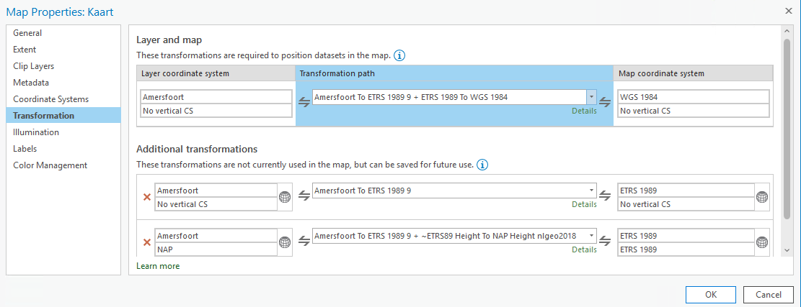

## Aandachtspunten voor CRS-gebruik

Na de relevante achtergronden bij de verschillende gebruikte CRS-en in Nederland, geeft dit hoofdstuk aandachtspunten bij het op passende wijze kiezen van en omgaan met CRS-en in onder andere informatiemodellen, in uitwisselmechanismes, -formaten en -standaarden en in het ontwerp van landelijke voorzieningen. Verder bevat het voorbeelden van hoe dit in verschillende softwarepakketen mogelijk is, zowel vanuit het perspectief van ontwikkelaars als vanuit het perspectief van de gebruiker.

### CRS-keuze bij verschillende toepassingen

In het [hoofdstuk 2](#achtergrond-gebruikte-crs-en-in-nederland) zijn de CRS-en beschreven die worden gebruikt in Nederland. Deze paragraaf geeft voor verschillende toepassingen de mogelijke CRS-en aan.

#### Opslag en uitwisseling van data

Voor opslag en uitwisseling wordt het gebruik van eenduidige CRS-en geadviseerd. De data hoeft voor opslag en uitwisseling niet geprojecteerd te zijn. Voor hoge nauwkeurigheid kunnen voor de horizontale component het geprojecteerde [RD](#crs-op-land-rd-en-nap), geografisch of geprojecteerd [ETRS89](#europese-crs-en-etrs89-en-evrs) (bij centimeternauwkeurigheid de realisatie ETRF2000) en realisaties van het [ITRS](#itrs) (inclusief epoche) worden gebruikt. Bij 3D datasets kan [RDNAP](#crs-op-land-rd-en-nap), geografisch ETRS89 (bij centimeternauwkeurigheid de realisatie ETRF2000) of een ITRS-realisatie (inclusief epoche) worden gebruikt. Daarnaast kan een samengesteld (compound) CRS worden gebruikt voor 3D data, waarbij de geprojecteerde of geografische 2D-data wordt aangevuld met een 1D CRS zoals NAP of EVRF2019. 

#### Visualisatie in een plat vlak

Bij visualisatie in een plat vlak wordt een geprojecteerd CRS gebruikt. De keuze van de kaartprojectie is afhankelijk van de toepassing en schaal. De RD-projectie is voor veel toepassingen binnen Europees Nederland een geschikte projectie met weinig vervorming en schaaleffecten. 

Het is een misverstand dat de RD-projectie niet geschikt is voor gebruik op zee, maar dat hiervoor een UTM-variant moet worden gebruikt zoals ETRS89-TM*zn*. Alleen in de meest noordwestelijke punt van de Nederlandse Exclusieve Economische Zone (EEZ) heeft de RD-projectie voor sommige toepassingen ongunstigere eigenschappen dan de ETRS89-TM*zn* projectie. ETRS89-TM*zn* heeft als nadeel dat Nederland in twee zones (31 en 32) valt, de RD-projectie geeft op land en het grootste deel van de Noordzee minder vervormingen dan ETRS89-TM*zn*.

##### Visualisatie op het web

Voor visualisatie op het web is het uitgangspunt dat de data wordt afgebeeld op een plat beeldscherm. De de-facto kaartprojectie die door veel tooling wordt ondersteund is de Web-Mercator projectie op basis van WGS 84. [SDW-BP](https://www.w3.org/TR/sdw-bp/) raden aan om minimaal [WGS 84](#wgs-84) aan te bieden voor visualisatie op het web. De Web-Mercator projectie is geschikt voor visualisatie, maar niet voor het uitvoeren van berekeningen. Voor nauwkeurige visualisatie toepassingen op het web is het daarom nodig data ook aan te bieden in andere CRS-en, zoals RD, ETRS89-LAEA, ETRS89-LCC en ETRS89-TM*zn* en bij de implementatie tooling en services te gebruiken die deze CRS-en ondersteunen.

#### Mogelijke CRS-en binnen INSPIRE

Bij visualisatie in het kader van INSPIRE zijn een aantal projecties van geografisch ETRS89 gedefinieerd, namelijk ETRS89-LAEA, ETRS89-LCC en ETRS89-TM*zn*. 

Voor INSPIRE-verplichtingen mag voor data-uitwisseling van 2D vectordata zowel geografisch als geprojecteerd ETRS89 worden gebruikt. Bij uitwisseling en visualisatie van 2D rasterdata wordt volgens sectie 2.2 van [Annex II](http://data.europa.eu/eli/reg/2010/1089/oj) ETRS89-LAEA gebruikt, tenzij daar binnen de technische specificaties van wordt afgeweken. Sectie 2.2.1 van [Annex II](http://data.europa.eu/eli/reg/2010/1089/oj) geeft de definitie van de eigenschappen van het ETRS89-LAEA raster, zoals de mogelijke resoluties en de celnummering.

Voor 3D datasets gelden voor vector- en rasterdata dezelfde voorwaarden als voor 2D data. Voor 3D data kan het geografisch ETRS89-GRS80h worden gebruikt of een samengesteld CRS met als 1D CRS een EVRS-realisatie op land en op zee LAT in getijdegebied (zee en kustgebied), of MSL in gebieden waar geen significant getij aanwezig is, en als 2D CRS een geografisch of geprojecteerd INSPIRE CRS. 

_VOORBEELD_
Afhankelijk van de specifieke INSPIRE datasets kan worden afgeweken van de voorwaarde in sectie 2.2 van [Annex II](http://data.europa.eu/eli/reg/2010/1089/oj) (namelijk dat ETRS89-LAEA wordt gebruikt voor het visualisatie en uitwisseling van rasterdata) en een specifieke andere aanbeveling worden gedaan. Een voorbeeld hiervan is de [Annex III](https://eur-lex.europa.eu/eli/reg/2013/1253/oj) in paragraaf 1.7.2 voor hoogterasters. 

<em>
Eisen voor hoogteraster coverages

(1) In afwijking van de eis in Paragraaf 2.2 van bijlage II, kan elk raster dat verenigbaar is met een van de
volgende coördinatenreferentiesystemen worden gebruikt om gerasterde hoogtegegevens te leveren:

— twee-dimensionale geodetische coördinaten (breedtegraad en lengtegraad) gebaseerd op een datum
gespecificeerd in 1.2 van bijlage II en met gebruik van de parameters van de GRS80 ellipsoïde;

— vlakke coördinaten met gebruik van het ETRS89 Lambert hoekgetrouwe conische coördinaatreferentiesysteem;

T
Het raster gespecificeerd in Paragraaf 2.2.1 van bijlage II moet niet worden gebruikt.
</em>

Waarbij *Het raster gespecificeerd in Paragraaf 2.2.1 van bijlage II* ETRS89-LAEA is. 

In aanvulling hierop wordt in de [technische specificaties voor hoogtedata](https://inspire.ec.europa.eu/id/document/tg/el) de aanbeveling gedaan om voor uitwisseling een samengesteld CRS te gebruiken, bestaand uit geografisch of geprojecteerd ETRS89 als 2D CRS en EVRS als 1D CRS: 

*Recommendation 13
  For pan-European global Elevation datasets the compound CRS ETRS89-GRS80/EVRS is recommended for data provision, in areas within the geographical scope of ETRS89.*

Voor visualisatie wordt het samengestelde CRS geprojecteerd ETRS89TM*zn* voor 2D en EVRS voor 1D aanbevolen:

*Recommendation 14 
  For regional European Elevation datasets, covering specific parts of countries, the compound CRS ETRS89-TMzn/EVRS is recommended for data provision and display, in areas within the geographical scope of ETRS89.*

</em>

### Aandachtspunten bij CRS in informatiemodel en informatieketen

In een informatiemodel voor geo-informatie worden regels opgenomen voor het te gebruiken CRS(-en). 
#### Aandachtspunten t.a.v. CRS-keuze

Bij het opstellen van het informatiemodel is de aanbeveling om te inventariseren welke CRS-en al gebruikt worden in het domein en waarom. Dit kan leiden tot verschillende keuzes in de implementatie, zoals te zien in het onderstaande voorbeeld voor BGT, BRO en DSO.

_VOORBEELD_ 
Het gebruik van CRS-en in de keten van inwinning tot uitwisseling en visualisatie van de Basisregistratie Grootschalige Topografie (BGT) kan als volgt worden geïnterpreteerd:

[](https://mermaid-js.github.io/mermaid-live-editor/edit/#pako:eNqFk8tuwjAQRX9l5BWViqoAixZVSESJUFX6UELpImFh4oG4JHbkOEUt8O91HqBCQd3d3Dm-nhkrGxJJhqRPlopmMYy9UADkxbz-tJUUsSwYqiP7Qay5EFwsSxdgaAUhcSeef3sH93M1gNbo2ffb3uTxKiQzqKEK7BjQcxpoXESxXkgtS6pJ6hpgLFeUJg00oVH8laJWHGvnCVHPqWD7QyjYUW9TVGtUK9OcKYHM8oQ2bdqB5_w-cnrS3GxyMeEfK4SplOqbYzUkOcFeqlAYT-sKgGP9G-1QTbOEmnlVCq1X56XczfncsnhI_id4hHNV8NXJ-4RkhBJ8VJ88wnyf5VpB_UjNst3OPtzobvA-8uG2N7vQvlyLRFIGrWHGb4ZZdnVI7Z1vcWi12wO7Up2D6u6VbcT2jes1z3OzcbHcOlbpO9bfQuX_sV3rgt-54Hcv-D1yTVJUKeXM_AabkgqJjjHFkPSNZLigRaLLeXcGLTJGNbqMa6lIf0GTHK8JLbT0v0R0MGrK4dQsMG3c3Q9UrBut)

Bij de inwinning van de BGT worden ETRS89, RD en lokale CRS-en gebruikt. Voor de opslag bij bronhouders, de Landelijke Voorziening en het dataplatform wordt voor de uitwisseling het CRS RD gebruikt. Voor uitwisseling tussen dataplatform en gebruiker worden het Nederlandse RD, het Europese ETRS89 en het wereldwijde WGS 84 gebruikt. Hierbij zijn voor de visualisatie van ETRS89 en WGS 84 verschillende kaartprojecties mogelijk. 

Voor de BRO is de keten echter anders:

[](https://mermaid-js.github.io/mermaid-live-editor/edit/#pako:eNqNk01TwjAQhv_KTk46A4e2HJSDM3SCjCMzOMWPA_EQyAKRNmHSVEbF_27SIohQ9NQ3z2723WzSDzLRAkmbzAxfzqGfMAWQF-NqGRut5roQaDz-EbhRK6mUVLOKA3SCESMJZeQZtih0qHufDC8uHd7SyNGn3hAuWluKSnix-WxNGOlzJTCVLwuER63Nu8TSk_zqhpEbZblL6j9-xwDiw47iox3F9R3teQyWecpn-x6tUVXur4NQbvky5XaqTQZnd3Rwe37kFBsHH9550H9Z9HBsCrk4uChGeqhhiOZVTjDfVe0G-2UdCUcJ3a2iUTWSEwOheqVSzQWcdazOzn8UPz6Wvc1xMoC-XqDdbQO4Dk4dthM0m1dxUMrQy7CUkZeRl7FPWN8brnI_aG4lruNWGSnzKxnVJrV85EHalcxz9-zUbE09pwe4G9TwsIZHNXzjCweRa-fAFGmQDF2PUrg_9MPnMmLnmCEjbScFTnmRlhP8dKnFUnCLXSGtNqQ95WmODcILq4dvakLa1hT4nUQldxeRVfDzC3VHO9M)

Bij de BRO kunnen bronhouders in verschillende CRS-en aanbieden. Bij intake in de landelijke voorziening wordt getransformeerd naar ETRS89. Voor uitwisseling tussen dataplatform en gebruiker worden het Nederlandse RD, het Europese ETRS89 en het wereldwijde WGS 84 gebruikt. Hierbij zijn voor de visualisatie van ETRS89 en WGS 84 verschillende kaartprojecties mogelijk.  

In de architectuur voor de landelijke voorziening van het Digitaal Stelsel Omgevingswet (DSO-LV) zijn weer andere keuzes gemaakt, waaronder het dubbel opslaan van data in twee CRS-en:

[](https://mermaid-js.github.io/mermaid-live-editor/edit/#pako:eNp9kktugzAQhq9iedFVqATpIqVVpFQmUdX0IUiTBXRhYCBWwY6MUVSFXKsX6MVqB6iSvlbM4_-_GQ3e4USkgF2cS7pZo7kfcYSqOm7TGyl4ShU1RYQmdhhhb-EHo8sIv6Cu6OiiT3TB5MDTE0CESfBozZcRbtXECX3y0sV22MJ-dc4gljV7_UZbMtiCRD7kUFTag-4olaqnTw39OpbjEhTKQQm9PaBEfLzLlHGqgJsm48gnSGTon-mTp9sW6R0t7J0srPNhuJoFaHRhqCuIrXuQCVVCHiO7z8S2rDGxD6FjQudwP2Ijy7KaCC8k5VUmZEkVA8MzO56tqZRXqD95o8_XmjSgeWZqy6oKCsbzxjuQifOz8YfDjHioC3U8tvGGX5Rp7ztvYzzAJWgZS_Vb2ZlehNUaSoiwq8MUMqpp5kfstbTe6FcDXsr0MbCb0aKCAaa1EsEbT7CrZA29iDCqT152qv0nKArQoQ)

Brondata van geometrieën voor de DSO-LV wordt volgens de architectuur aangeleverd in ETRS89 of RD. Binnen de DSO-LV worden de geometrieën *'as is'* getransformeerd voor dubbele opslag in RD en ETRS89. De bronhouder is verantwoordelijk voor toepassing van het langelijnenadvies. Geometrieën worden via een API uitgewisseld in RD, ETRS89 en WGS 84 Web-Mercator. Voor de transformatie tussen ETRS89 en WGS 84 wordt een [nultransformatie](#wgs-84-gelijkstellen-aan-etrs89-nultransformatie) gebruikt. In de viewer van DSO-LV wordt altijd de RD-kaartprojectie gebruikt en kan de gebruiker kiezen tussen het weergeven van RD of ETRS89 coördinaten.

#### Aandachtspunten t.a.v. informatie over CRS-en
In het informatiemodel en de bijbehorende afspraken wordt bij voorkeur de volgende informatie vastgelegd:

- In welk(e) CRS(-en) mogen gegevens worden aangeleverd en opgevraagd.
- In welk(e) CRS(-en) worden gegevens opgeslagen.
- Waar eventueel coördinaatformaties plaatsvinden, bijvoorbeeld bij uitwisseling tussen dataplatform en gebruiker.
- Hoe informatie over het bron CRS en de gebruikte transformaties wordt opgeslagen bij gebruik van meerdere CRS-en.
- De numerieke precisie van coördinaten in het model.

De volgende tabel geeft de link naar voorbeelden van het specificeren van het CRS in informatiemodellen:

|Informatiemodel|Soort specificatie|Link|
|---|---|---|
|Omgevingswet|Gebruik van RD en ETRS89 in GML-bestanden|https://geonovum.github.io/TPOD/CIMOW/IMOW_v2.0.0.pdf#page=15|
|BRO Booronderzoek|2D: Gebruik van ETRS89 voor opslag, aanlevering toegestaan in RD, ETRS89 en WGS 84|https://docs.geostandaarden.nl/bro/bhr-g/#referentiestelsels-voor-de-horizontale-positie|

#### Aandachtspunten t.a.v. dubbel opslaan of on-the-fly transformeren

Bij het ontwerp van het informatiemodel, landelijke voorziening of dataportaal kan de afweging worden gemaakt om coördinaattransformaties op verschillende plaatsen in de keten te laten plaatsvinden en data dubbel op te slaan of juist de transformaties on-the-fly uit te voeren. Aandachtspunten bij deze afweging zijn onder andere de authenticiteit van gegevens, de kostenafweging tussen dubbel opslaan en (herhaaldelijk) on-the-fly transformeren en de borging van voldoende performance. 

#### Nauwkeurigheid van coördinaten

De nauwkeurigheid van coördinaten moet minstens de nauwkeurigheid realiseren die vermeld wordt in het informatiemodel of bijgeleverde inwinningseisen. Meestal is het aantal decimalen dat in software standaard wordt opgeleverd groter. Deze decimalen hebben dan geen betekenis meer. Om te voorkomen dat er te grote databestanden ontstaan, wordt aanbevolen de coördinaten af te ronden op 1 decimaal meer dan de nauwkeurigheid van de dataset vereist. Hierdoor kunnen fouten bij herhaaldelijk heen en weer transformeren worden voorkomen.

_VOORBEELD_ zoals opgenomen in [IMOW](https://geonovum.github.io/TPOD/CIMOW/IMOW_v2.0.0.pdf#page=15) en het [model Basisgeometrie](https://docs.geostandaarden.nl/nen3610/def-st-basisgeometrie-20200930/#nauwkeurigheid-van-coordinaten)

*Coördinaten opgenomen bij een geometrie worden standaard uitgewisseld met een getalsnauwkeurigheid van 1 mm of het equivalent daarvan in graden. Voor RD, NAP en ETRS89 komt dat overeen met de volgende nauwkeurigheden:*

- *RD in meters 3 decimalen (1 mm);*  
- *NAP-hoogte in meters 3 decimalen (1 mm);*  
- *ETRS89-breedte in graden 8 decimalen (1,1 mm);*  
- *ETRS89-lengte in graden 8 decimalen (0,7 mm);*  
- *ETRS89-hoogte in meters 3 decimalen (1 mm).*

*Alles wat nauwkeuriger is wordt afgerond op deze nauwkeurigheid van 3 of 8 decimalen. Afronding is volgens de volgende regel:*

- *0,0015 -\> 0,002;*
- *0,0014 -\> 0,001.*

### Aandachtspunten bij meerdere CRS-en

Bij het gebruik van meerdere CRS-en bestaat risico op introductie van fouten door onjuiste implementatie van de relaties tussen CRS-en. Eindgebruikers worden geadviseerd data waar mogelijk op te vragen in hetzelfde CRS.

Aanbieders van data worden geadviseerd om data aan te bieden in de verschillende CRS-en gericht op de eindgebruikers. Hierbij is het advies zo nauwkeurig mogelijk te transformeren, omdat het niet altijd duidelijk is wie de eindgebruiker is.

Wanneer voor opslag, uitwisseling en/of visualisatie andere CRS-en worden gebruikt zijn er een aantal aandachtspunten, de belangrijkste zijn:

- Voorkom dat te grote geometrische of topologische verschillen ontstaan
- Maak gebruik van een eenduidige coördinaatransformatie (en leg dit vast)

#### Vormvastheid

Een rechte lijn in werkelijkheid is meestal geen rechte lijn in een kaart, maar een lijn die licht krom loopt. Om er voor te zorgen dat een begrenzing in de kaart -ongeacht de kaartprojectie- met voldoende nauwkeurigheid eenduidig is, heeft de NSGI hiervoor een [langelijnenadvies](https://forum.pdok.nl/uploads/default/original/2X/c/c0795baa683bf3845c866ae4c576a880455be02a.pdf) geformuleerd. In dit advies staat dat lange lijnsegmenten van grenzen voorzien moeten worden van synthetische tussenpunten om bij coördinaatransformatie grote geometrische en topologische verandering van de data te voorkomen. De afstand tussen deze tussenpunten is afhankelijk van de acceptabele afwijking en de locatie op aarde. Voor Europees Nederland inclusief EEZ kan de volgende tabel worden gehanteerd:

|Acceptabele afwijking|Advies lijnlengte|
|----|----|
|1 mm	                 |200 m   |
|1 cm                    |500 m   |
|1 dm                    |2 km    |
|1 m                     |5 km    |
|10 m                    |20 km   |
|100 m                   |50 km   |

Voor een nauwkeurigheid van 1 mm zijn dus punten met 200 m tussenafstand nodig voor de in Nederland gangbare projecties. Voor het genereren van synthetische tussenpunten kan afhankelijk van wat bedoeld is, gekozen worden tussen punten op een rechte lijn in de kaart of een rechte lijn in werkelijkheid (geodetische lijn in ETRS89).

_ADVIES_ Wanneer lijnen worden getransformeerd met behulp van RDNAPTRANS™ gebruik dan geen lijnsegmenten die langer zijn dan 200 meter om de lijnen eenduidig te transformeren met de nauwkeurigheid van RDNAPTRANS™.

_VOORBEELD_ In de de [stelselafspraken versie 2.5 van 27 september 2021 voor het DSO](https://iplo.nl/publish/library/219/dso_architectuur_stelselafspraken_versie-2-5.pdf) is het langelijnenadvies opgenomen als kader opgenomen voor de aanlevering van geometrieën.

#### Aandachtspunten bij coördinaattransformatie

De relatie tussen CRS-en is vastgelegd in een [coördinaattransformatie](#coordinaattransformatie-datumtransformatie-en-coordinaatconversie). De relaties RDNAP, ETRS89, ITRS en WGS 84 zijn weergegeven in onderstaande figuur met daarbij de organisatie die de gegevens van coördinaattransformatie beheerd.

    <figcaption>Voor coördinaattransformatie van RDNAP naar WGS 84 moet eerst naar ETRS89 en dan naar ITRS worden getransformeerd. Voor de de transformatie tussen RDNAP is de NSGI verantwoordelijk. Voor de transformatie tussen ETRS89 en ITRS publiceert EUREF parameters. De relatie tussen ITRS en WGS 84 wordt beheerd door de Amerikaanse NGA.</figcaption>

In de volgende paragrafen worden de coördinaattransformatie tussen RD en ETRS89 en tussen ETRS89 en WGS 84 beschreven.

##### Transformatie en conversie tussen RDNAP en ETRS89

Bij de koppeling tussen ETRS89 en RD in de jaren 1990 werden systematische verschillen gevonden. Vanwege de wens van gebruikers dat RD-coördinaten niet wijzigden bij de introductie van ETRS89, is er voor gekozen om de verschillen te modelleren in correctiegrid. Het correctiegrid maakt deel uit van de coördinaattransformatie procedure tussen geprojecteerde RD-coördinaten en geografische ETRS89-coördinaten. NAP hoogten kunnen met een quasi-geoïdemodel naar ellipsoïdische hoogten in ETRS89 worden getransformeerd met een precisie die hoger is dan de ETRS89-coördinaten die met de meeste GNSS-metingen wordt verkregen. Het correctiegrid en quasi-geoïdemodel zijn onderdeel van de procedure RDNAPTRANS™. 

RDNAPTRANS™ kent verschillende versies, in veel (oudere) GIS-pakketten en andere software is RDNAPTRANS™ niet volledig geïmplementeerd, wat fouten op decimeterniveau oplevert. Met de publicatie van RDNAPTRANS™ 2018 is een versie beschikbaar gekomen die voor aanbieders van GIS-software eenvoudiger te implementeren is. In de regel blijven de oudere, niet juist geïmplementeerde, versies ook beschikbaar in software, waarmee het voor gebruikers belangrijk is om goed te weten welke transformatie zij het beste kunnen gebruiken in hun software. De NSGI publiceert advies over het gebruik en de actuele procedure van RDNAPTRANS™ haar [website](https://www.nsgi.nl/rdnaptrans). Voor validatie van implementaties van RDNAPTRANS™ heeft de NSGI een [transformatievalidatieservice](https://www.nsgi.nl/geodetische-infrastructuur/producten/programma-rdnaptrans/transformatievalidatie) beschikbaar.  Voor de transformatie tussen RDNAP en ETRS89 met gebruik van de RDNAPTRANS™ procedure is tevens een [transformatie-API](https://www.nsgi.nl/coordinatentransformatie-api) beschikbaar bij de NSGI. Voorbeelden van implementatie van RDNAPTRANS™ in software worden gegeven in de paragraaf [Aandachtspunten bij toepassing in software](#aandachtspunten-bij-toepassing-in-software).

_AANBEVELING_  Voor de uitwisseling van geo-informatie binnen Europa is het nadrukkelijke advies om altijd de weg via ETRS89 te kiezen. Bij gebruik van de actuele RDNAPTRANS™ procedure is daarbij voor het Nederlandse deel een nauwkeurigheid op centimeterniveau gewaarborgd. 

##### Transformatie tussen ETRS89 en ITRS/WGS 84

Wanneer na zorgvuldige afweging gebruik wordt gemaakt van WGS 84 of ITRS voor visualisatie of uitwisseling zijn verschillende strategieën mogelijk:

* **[WGS 84 gelijkstellen aan ETRS89 (nultransformatie)](#wgs-84-gelijkstellen-aan-etrs89-nultransformatie)**. Dit is de juiste keuze als er geen expliciete realisatie of epoche van WGS 84 wordt gebruikt. Het beoogd gebruik van de WGS 84 coördinaten mag geen toepassing zijn die hoge nauwkeurigheid vereist, tenzij er zekerheid is dat alle data gebruikt maakt van de nultransformatie.
* **[Tijdsafhankelijke transformatie tussen ETRS89 en ITRS/WGS 84](#tijdsafhankelijke-transformatie-tussen-etrs89-en-itrs-wgs-84)**. Dit is de juiste keuze wanneer wel een expliciete realisatie én epoche van ITRS of WGS 84 nodig is voor de toepassing.

Het is verstandig de gekozen strategie in de metadata te vermelden.

###### WGS 84 gelijkstellen aan ETRS89 (nultransformatie)

Wanneer de brondata in RD of ETRS89 is en het beoogd gebruik van de data bestaat uit visualisatie of combinatie met andere datasets, kan worden gekozen om WGS 84 en ETRS89 aan elkaar gelijk te stellen. Dit is de standaard implementatie in meerdere GIS-pakketten, namelijk dat zonder expliciete vermelding van de WGS 84 en ETRS89-realisaties een nultransformatie wordt gebruikt. De nauwkeurigheid van de nultransformatie is circa 2 meter. Door het toepassen van deze strategie moet het resultaat worden geïnterpreteerd als een CRS dat bestaat uit een ongedefinieerd datum met als coördinatensysteem lengte en breedte. Het voordeel van het gebruik van de nultransformatie is dat de transformatie niet tijdsafhankelijk is en coördinaten dus niet veranderen in de tijd.

_VOORBEELD_ In de [stelselafspraken voor het DSO, versie 2.5 27-09-2021](https://iplo.nl/digitaal-stelsel/documenten/architectuurdocumenten/) is gebruik van de nultransformatie als volgt vastgelegd:

*Voor de uitlevering via API’s kan ook Pseudo-Mercator op basis van WGS84 (EPSG:3857) worden ondersteund. Hiermee kan bijvoorbeeld in gebruikerstoepassingen worden voorzien die beter aansluiten op Google Maps™. Voor de transformatie van (RD via) ETRS89 naar WGS84 is de aanbeveling om tussen ETRS89 en WGS84 een nultransformatie toe te passen en de coördinaten in ETRS89 en WGS84 dus gelijk aan elkaar te stellen. Gezien de onnauwkeurigheid van WGS84 is dat een gebruikelijke keuze met een acceptabele nauwkeurigheid, waarmee tevens voorkomen wordt dat de verkregen coördinaten in WGS84 door de tijd heen veranderen als gevolg van de tektonische beweging van Europa.*

Bij gebruik van data waarbij het aangegeven CRS WGS 84 (EPSG:4326) is zonder duidelijke informatie over het CRS van de brondata, de gebruikte transformaties, realisatie en/of het epoche moet de gebruiker er rekening mee houden dat de data systematische fouten in de orde van meters kan bevatten. De toepassing bepaalt of dit acceptabel is of niet. 

###### Tijdsafhankelijke transformatie tussen ETRS89 en ITRS/WGS 84

Wanneer de toepassing of dataspecificatie expliciet een realisatie en epoche van WGS 84 of ITRS vraagt, of data gecombineerd wordt met de actuele locatie van de eindgebruiker, dan kan worden gekozen de transformatie tussen ETRS89 en WGS 84 uit te voeren met hoge nauwkeurigheid voor een specifieke realisatie op een specifiek epoche. Dergelijke transformaties zijn vaak niet standaard geïmplementeerd in GIS-software, waardoor de gebruiker zelf de juiste transformatie moet definiëren in de software. 

Voor Nederlandse data mag voor ETRS89 de realisatie ETRF2000 worden gekozen. Wanneer de WGS 84-realisatie niet is gespecificeerd, dan wordt de meest recente realisatie gekozen (2D/3D WGS 84 (G2139)) of de realisatie van het (gemiddelde) moment van inwinning van de dataset.

Om te kunnen transformeren worden de door EUREF gepubliceerde tijdsafhankelijke [transformatieparameters tussen ETRF2000 en ITRS gebruikt](http://etrs89.ensg.ign.fr/pub/EUREF-TN-1.pdf) die ook in EPSG zijn opgenomen. Bij deze transformatie wordt de WGS 84-realisatie dan gelijkgesteld aan de bijbehorende ITRS-realisatie (ITRF2014 voor WGS 84 (G2139)). De keuze van het epoche kan voortkomen uit de datum van inwinning, publicatiedatum of een expliciete specificatie en kan indien noodzakelijk per geometrie verschillend zijn.

_VOORBEELD_ Voor de uitwisseling van terrein- en obstakelgegevens voor de luchtvaart in Europa [specificeert Eurocontrol](https://www.eurocontrol.int/sites/default/files/2021-07/eurocontrol-tod-manual-ed-3-0.pdf#page=125) dat het horizontale referentiesysteem WGS 84 is. In de [handreiking bij deze specificatie](https://www.eurocontrol.int/sites/default/files/publication/files/20130204-do-spec-vol.2-v1.0.pdf#page=16) wordt aangegeven dat WGS 84 voor deze toepassing wordt gelijkgesteld aan ITRF2000 op epoche 2000.0.

Indien de publicatiedatum van de dataset wordt gekozen als epoche voor de transformatie worden bij regelmatige updates (bijvoorbeeld jaarlijks) de WGS 84/ITRS coördinaten bijgesteld als gevolg van de platentektoniek. Wanneer als epoche de (gemiddelde) datum van de inwinning van de dataset, komen de coördinaten gemiddeld het best overeen met de WGS 84/ITRS coördinaten op het moment van inwinning. 

_AANBEVELING_ Wanneer een coördinaattransformatie plaatsvindt in de keten van inwinning tot gebruik is het advies de gekozen transformatieprocedure in het model en/of metadata op te nemen. Bij tijdsafhankelijke transformaties, zoals van ETRS89 naar WGS 84 moet dan ook het referentieepoche worden opgenomen. Tussen RDNAP en ETRS89 is het van belang gebruik te maken van de RDNAPTRANS™ procedure. 

_VOORBEELD_
In het informatiemodel van de BRO is gekozen voor het opnemen van het attribuut [Coördinaattransformatie](https://docs.geostandaarden.nl/bro/bhr-g/#detail_class_Model_Cordinaattransformatie) waarin in de waardelijst de mogelijke transformaties zijn vastgelegd.

### CRS bij uitwisselingsformaten en standaarden

Niet alle uitwisselingsformaten en standaarden ondersteunen (volledig) het gebruik van meerdere CRS-en. De [Handreiking Geometrie in uitwisselingsformaten](https://geonovum.github.io/geox/) geeft een keuzehulp van gebruik van uitwisselingsformaten voor 2D vector bestanden, waarin ook de ondersteuning van CRS-en is opgenomen. De tabel hieronder geeft een samenvatting van de ondersteuning van CRS-en voor deze formaten.

|CRS|[HTML](https://geonovum.github.io/geox/#html)|[GeoJSON](https://geonovum.github.io/geox/#geojson)|[GeoPackage](https://geonovum.github.io/geox/#geopackage)|[GML](https://geonovum.github.io/geox/#gml)|[RDF](https://geonovum.github.io/geox/#rdf)|
|---|---|---|---|---|---|
|RD|&#10005;|&#65374;|&#10003;|&#10003;|&#10003;|
|ETRS89|&#10005;|&#65374;|&#10003;|&#10003;|&#10003;|
|WGS 84|&#10003;|&#65374;|&#10003;|&#10003;|&#10003;|
|CRS84|&#65374;|&#10003;|&#10003;|&#10003;|&#10003;|
|Web-Mercator|&#10005;|&#65374;|&#10003;|&#10003;|&#10003;|

De tabel laat zien dat de eenvoudige formaten HTML en GeoJSON default alleen WGS 84 of CRS84 ondersteunen. In het geval dat een formaat alleen WGS 84 ondersteunt moet dit worden geïnterpreteerd als een ongedefinieerd CRS met geografische coördinaten en lage nauwkeurigheid, omdat bijvoorbeeld een [nultransformatie](#wgs-84-gelijkstellen-aan-etrs89-nultransformatie) kan zijn toegepast. Voor veel toepassingen op het web voldoet deze lagere nauwkeurigheid. De andere formaten ondersteunen meerdere CRS-en, ook de CRS-en die niet in deze tabel zijn opgenomen, maar wel zijn gegeven in [Bijlage A](#bijlage-a-crs-overzicht-tabel).

#### OGC API

De [OGC API-standaarden](https://ogcapi.ogc.org/) worden ontworpen om eenvoudig geodata op het web te publiceren. De standaarden zijn modulair opgebouwd uit API-bouwblokken. Ondersteuning voor meerdere CRS-en is in de OGC API Roadmap alleen voorzien in de bouwblokken voor OGC API Features, maar er wordt naar verwezen in de [OGC API Common repository](https://github.com/opengeospatial/ogcapi-common) als deel 3 van deze bouwblokken. 

De OGC API Features bevat de bouwblokken voor het creëren, bewerken en bevragen van Features. In de [deel 2 van OGC API Features](https://docs.opengeospatial.org/is/18-058/18-058.html) beschrijving wordt [deel 1 van de OGC API Features](http://docs.opengeospatial.org/is/17-069r3/17-069r3.html), waarin WGS 84 wordt voorgeschreven, uitgebreid voor de ondersteuning van meerdere CRS-en. Met deze uitbreiding is het gebruik van meerdere CRS-en mogelijk mits er een [NTS](#naamgeving-van-crs) beschikbaar is en het CRS voldoet aan [ISO 19111:2019](https://www.iso.org/obp/ui/#iso:std:iso:19111) / [OGC Abstract Specification Topic 2: Referencing by coordinates](http://docs.opengeospatial.org/as/18-005r4/18-005r4.html) . Hiermee wordt, naast bijvoorbeeld RDNAP, ook de ontsluiting van data opgeslagen in de realisatie van een wereldwijd dynamisch CRS zoals ITRF2014 op en bepaald epoche ondersteund in OGC API Features. De OGC API Features deel 2 bevat onder andere een beschrijving over hoe:

* wordt aangegeven wat het CRS (en bij een dynamisch CRS het referentie epoche) van de opgeslagen dataset is,
* wordt aangegeven welke CRS-en worden ondersteund door de API,
* data in een specifiek CRS kan worden opgevraagd.

#### Gebruik van andere CRS-en in GeoJSON

Voor GeoJSON zijn in de [tabel met uitwisselingsformaten](#crs-bij-uitwisselingsformaten-en-standaarden) tildes (&#65374;) aangegeven voor andere CRS-en dan WGS 84. GeoJSON ondersteunt default alleen WGS 84, echter de standaard biedt de optie voor gebruik van andere CRS-en, mits door de ontvangende en leverende partij vooraf is afgesproken welk CRS wordt uitgewisseld. Deze ruimte in de GeoJSON-specificatie wordt bijvoorbeeld in de [DSO API-strategie](https://iplo.nl/digitaal-stelsel/aansluiten/standaarden/api-en-uri-strategie/) gebruikt door het aangeboden en gevraagde CRS te specificeren in de header van een REST-API aanroep.

_VOORBEELD_ 
In een aanroep naar de REST-API van de DSO-LV moet het gebruikte CRS voor de geometrie in de aanroep expliciet worden aangegeven door middel van de `Content-Crs` header. Het CRS waarin de geometrie in het antwoord is gewenst wordt opgegeven via de `Accept-Crs` header.

#### OGC Features and Geometries JSON

Op het moment van schrijven van deze handreiking is binnen OGC een [OGC Features and Geometries JSON werkgroep](https://www.ogc.org/projects/groups/featgeojsonswg) actief. De werkgroep richt zich op de ontwikkeling van OGC Features and Geometries JSON (JSON-FG) als uitbreiding op GeoJSON. De aanpak is om het te baseren op GeoJSON, alles wat in GeoJSON al is gespecificeerd intact te laten, en het maar zo minimaal als mogelijk uit te breiden. Het wordt dus zeker geen GML in JSON. Kandidaat-uitbreidingen zijn:

* Gebruik van andere coördinaatreferentiesystemen dan WGS 84;
* Ondersteuning voor ellipsvormige meetwaarden;
* Support voor 3D volumes;
* Handreikingen voor het opnemen van eigenschappen van geo-objecten, zoals temporele eigenschappen.

### Aandachtspunten  bij toepassing in software

Diverse software (bibliotheken) ondersteunen het gebruik van meerdere CRS-en. Deze paragraaf geeft een aantal voorbeelden van software die coördinaattransformaties ondersteund en is zeker niet volledig. De voorbeelden zijn bedoeld als handreiking hoe een aantal aandachtspunten uit dit document praktisch toegepast kunnen worden.

#### De merknaam RDNAPTRANS™

RDNAPTRANS™ is een beschermde merknaam. Wanneer RDNAPTRANS™ is geïmplementeerd in een applicatie kan deze worden gecertificeerd door het Kadaster. Voor deze certificering wordt een aanvraagformulier ingevuld waarbij de aanvrager aantoont dat de implementatie is gevalideerd aan de criteria van RDNAPTRANS™. Voor de validatie wordt de RDNAPTRANS™ [Transformatievalidatieservice](https://www.nsgi.nl/geodetische-infrastructuur/producten/programma-rdnaptrans/transformatievalidatie) gebruikt. Na deze certificering mag de leverancier de merknaam RDNAPTRANS™ gebruiken. Of een applicatie RDNAPTRANS™ gecertificeerd is kan worden gevraagd bij de leverancier of NSGI. Voorbeelden van gecertificeerde applicaties zijn [FME](https://hub.safe.com/publishers/safe-lab/transformers/rdnaptrans2018) en [DgDialog BGT](https://bgtsoftware.nl/dg-dialog-bgt-versie-7-9-beschikbaar/).

#### Voor ontwikkelaars

##### PROJ

[PROJ](https://proj.org) is een open source softwarebibliotheek voor datumtransformaties en coördinaatconversies, tot februari 2018 was de software bekend onder de naam PROJ.4. PROJ heeft zich ontwikkeld van een software voor conversie van coördinaten tot een software voor geodetische datumtransformaties en coördinaatconversies. In versie PROJ 8.1.1 worden RDNAPTRANS™ en tijdsafhankelijke transformaties ondersteund, versies gebaseerd op PROJ.4 (voor 2018) hebben deze ondersteuning niet. PROJ wordt onder andere gebruikt in de bibliotheek voor het omzetten van dataformaten [GDAL](https://gdal.org) en de open-source GIS-software [QGIS](https://qgis.org).
#### Voor gebruikers
Het is onmogelijk om een volledig overzicht te geven hoe gebruikers in elk geografisch softwarepakket gebruik kunnen maken van de correcte CRS-en en transformatieprocedures. Ter illustratie beperken we ons daarom tot twee voorbeelden aan de hand van veelgebruikte software, namelijk QGIS en ArcGIS Pro. 
##### Voorbeeld: QGIS

[QGIS](https://www.qgis.org/) is een open source GIS-software. De ondersteuning van datumtransformaties en coördinaatconversies is gebaseerd op PROJ. QGIS kan ook worden gebruikt om conform het langelijnenadvies tussenpunten volgens een rechte lijn in de kaartprojectie te berekenen. Het berekenen van tussenpunten volgens een rechte lijn in werkelijkheid (geodetische lijn) volgens het [langelijnenadvies](#vormvastheid) is minder eenvoudig, maar kan wel met een speciale functie van PROJ.

_VOORBEELD_ QGIS 3.20 bevat diverse implementaties van de transformatie tussen RD en ETRS89 die zijn opgenomen in de EPSG-database. Zodra in een project RD en ETRS89 worden gebruikt verschijnt een pop-up met de vraag welke transformatie moet worden gebruikt, behalve wanneer de gebruiker al een default heeft geconfigureerd. De meest nauwkeurige transformatie, in het geval van QGIS 3.20 is dat de 2D-implementatie van RDNAPTRANS™, wordt als eerste getoond. In onderstaande figuur wordt het pop-up scherm getoond.

<figure id="plaatjeQGIS">
    
    <figcaption>Keuzescherm voor transformatie tussen RD en ETRS89 in QGIS.</figcaption>
</figure>

De in rood omleidende elementen in de pop-up duiden hier op het gebruik van RDNAPTRANS™, bijvoorbeeld de hoge nauwkeurigheid van de transformatie (0.001 m), de verwijzing naar RDNAPTRANS™2018 in de omschrijving en het gebruik van het correctiegrid in de PROJ-string.

##### Voorbeeld: ArcGIS Pro

Het Esri softwarepakket [ArcGIS Pro](https://www.esri.nl/nl-nl/producten/arcgis-pro/home) biedt ondersteuning voor coördinaattransformaties, waaronder de transformatie tussen RD en ETRS89. Lange tijd is dit de [verbeterde benaderde transformatie](https://dehollandsecirkel.courant.nu/issue/INFO/2014-09-01/edition/null/page/20?query=) op basis van de procedure uit 2008 geweest, sinds een paar jaar wordt ook RDNAPTRANS™2018 ondersteund. In versie ArcGIS Pro 2.9, welke in 2021 beschikbaar is gekomen, is ook de transformatie in het verticale vlak, ETRS89 en NAP, geïntroduceerd.

_VOORBEELD_ In ArcGIS Pro worden CRS-en en coördinaattransformaties van verschillende bronnen gebruikt, de bron wordt aangeduid met een ‘Authority’, meestal EPSG of Esri. Ieder CRS en coördinaatransformatie heeft een eigen zogenaamde Wel-Known ID (WKID), wanneer de ‘Authority’ EPSG is komt de WKID overeen met de EPSG-code.

Zodra er in een in ArcGIS Pro 2D-data van meerdere CRS-en wordt gebruikt dan wordt automatisch de meest nauwkeurige beschikbare transformatie ingesteld. Voor de 2D-transformatie van RD (WKID:28992) naar ETRS89-GRS80 (WKID:4258) is dat in 2021 conform RDNAPTRANS™2018 de ‘Amersfoort To ETRS 1989 9’ (WKID:9282) transformatie. Eventuele oude (minder nauwkeurige) transformaties, bijvoorbeeld gebaseerd op benaderingen van eerdere RDNAPTRANS™-versies kunnen door de gebruiker ook nog ingesteld worden.

De data wordt op deze manier on-the-fly geprojecteerd van ETRS89 naar RD en vice versa. Het is met de Project-tool ook mogelijk om een conversie te doen van ETRS89 naar RD (en vice versa), zodat de data wordt opgeslagen in het andere CRS.

<figure id="plaatjeESRI1">
    
    <figcaption>Keuzescherm voor transformatie tussen RD en ETRS89 in ARcGIS Pro. De transformatie met naam ‘Amersfoort To ETRS 1989 9’(WKID:9282) is conform RDNAPTRANS™2018.</figcaption>
</figure>

Wanneer er NAP (WKID: 5709) als CRS voor de hoogte is ingesteld, dan kan er vanaf ArcGIS Pro 2.9 ook een correctie transformatie worden ingesteld tussen NAP en ETRS89 (WKID:115701) en vice versa. Hiervoor wordt de transformatie ‘ETRS89 height To NAP Height nlgeo2018’ (WKID:9283) gebruikt.

<figure id="plaatjeESRI2">
    
    <figcaption>Keuzescherm voor de transformatie van RD en NAP naar ETRS89 bij 3D-datasets in ArcGIS Pro. Feitelijk wordt er in ArcGIS Pro een samengestelde transformatie uitgevoerd conform RDNAPTRANS™2018, eerst voor het horizontale vlak en daarna voor de hoogte.
    </figcaption>
</figure>

Voor ondersteuning van de hoogtetransformatie is een additionele setup noodzakelijk. Gebruikers van ArcGIS Pro 2.9 kunnen deze downloaden op dezelfde locatie waar ook de andere setups van ArcGIS te vinden zijn, namelijk https://my.esri.com. 

Voor RD naar WGS84 (en vice versa) wordt er ook automatisch een samengestelde transformatie uitgevoerd die via ETRS89 loopt: Dus eerst ‘Amersfoort To ETRS 1989 9’ (WKID: 9282) en daar ‘ETRS1989 To WGS 1984’ (WKID: 1149). Bij de laatste transformatie is ETRS89 feitelijk gelijkgesteld aan WGS84, er wordt een nultransformatie toegepast zonder translatie of rotatie. Ook voor de transformatie tussen RD naar WGS84 zijn oude parameters nog beschikbaar voor ‘backward compatability’ met gebruikte transformaties.

<figure id="plaatjeESRI3">
    
    <figcaption>Keuzescherm voor de transformatie van RD en NAP naar WGS 84 in ArcGIS Pro. Feitelijk wordt voor de transformatie tussen ETRS89 en WGS 84 een nultransformatie gebruikt.
    </figcaption>
</figure>

