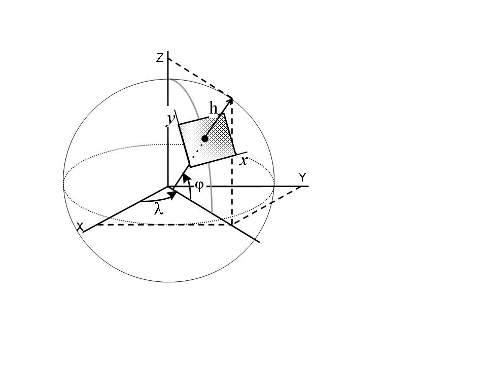
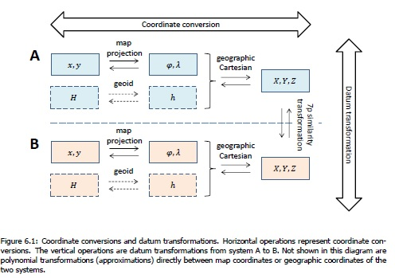

## Bijlage B: Coördinaat referentiesystemen 

Geo-informatie is direct gekoppeld aan locaties op aarde. De wijze waarop dat gebeurt wordt beschreven in het ruimtelijk-referentie systeem. Er zijn meerdere methoden om de locatie van objecten vast te leggen. De meest bekende methode is het gebruik van coördinaatreferentiesystemen (CRS) waarbij coördinaten van een locatie worden vastgelegd. 

CRS-en nemen de vorm van de aarde als uitgangspunt om de locaties vast te leggen. Maar niets is zo ingewikkeld als meten op een bol met de bedoeling dit in een plat vlak (kaart) weer te geven. Zeker niet als die bol niet een exacte bol is.

### <mark>Defintie CRS</mark>

Defintie CRS met datum en CS geven volgens crs-eu.eu
### Geografisch en geprojecteerd CRS

Ook verwijzen naar https://docs.qgis.org/3.16/nl/docs/gentle_gis_introduction/coordinate_reference_systems.html ?

#### Ellipsoïdes: Het benaderen van de aardbol

Bij een grove benadering is de aarde een bol. Maar de aarde is bij de polen afgeplat, en een driedimensionale ellips, een zogenaamde ellipsoïde, is een betere benadering. Maar ook dan is de vorm van het aardoppervlak, met al zijn bergen en dalen, onmogelijk perfect wiskundig te beschrijven.

Een ellipsoïde voor wereldwijd gebruik heeft tot doel het gehele aardoppervlak zo goed mogelijk te beschrijven. Er kunnen echter ook ellipsoïdes gedefinieerd worden met een iets ander middelpunt, een iets andere oriëntatie en een iets andere vorm, die zo goed mogelijk bij een bepaald gedeelte van het aardoppervlak passen. Zo is voor Nederland in de negentiende eeuw de Bessel-ellipsoïde gedefinieerd. Een voorbeeld van een wereldwijde ellipsoïde is de WGS84-ellipsoïde, van het GPS-systeem (satellietnavigatie).

Coördinaten op zo’n wiskundig lichaam (de benadering van de aardbol) zijn geografische coördinaten. Een punt op aarde wordt daarbij beschreven door een lengtegraad en een breedtegraad ten opzichte van de nulmeridiaan door Greenwich respectievelijk de evenaar.

Het omrekenen tussen verschillende ellipsoïdes heet datumtransformatie.

#### Kaartprojecties: De aarde plat slaan

Hoe beeld je de bolle aarde af op een plat vlak zoals een kaart of een beeldscherm? De bolle aarde volledig correct verbeelden in een platte kaart is onmogelijk. Welke projectiemethode er ook gebruikt wordt, de werkelijkheid wordt altijd geweld aangedaan. In een kaart kunnen niet tegelijkertijd met de werkelijkheid overeenkomende maten voor hoeken, afstanden en oppervlaktes worden gemeten. Hoe groter het gebied is dat wordt afgebeeld, hoe groter de vervormingen in het kaartvlak zijn. Een bekend voorbeeld is de vroeger populaire kaart en nog steeds bekende Mercator-projectie van de wereld. Daarbij wordt Groenland als een enorm eiland afgebeeld, terwijl het in het echt qua oppervlakte overeenkomt met het Arabische schiereiland. Maar de vorm van de landen is wel correct.

In de loop der tijd zijn er diverse methodes bedacht om geografische coördinaten (van de ellipsoïde) naar coördinaten in een plat vlak om te rekenen. Doel was steeds om de vervormingen zo klein mogelijk te maken. Deze rekenkundige methodes worden kaartprojecties genoemd. Welke kaartprojectie het meest geschikt is, hangt af van de toepassing en van de grootte, de vorm en de positie op aarde van het af te beelden gebied. Maar kaartprojecties zonder enige vervorming bestaan niet.

#### Representatie van coördinaten

De aarde kan eenvoudig worden gemodelleerd door een ellipsoïde, waarvan het snijpunt van de lange en korte as het middelpunt van de aarde geeft en de korte as samenvalt met de rotatieas van de aarde. De ligging (en/of hoogte) van objecten kan op de ellipsoïde worden vastgelegd met geocentrische of geografische coördinaten. Voor een afbeelding van objecten op een plat vlak is een kaartprojectie nodig, in een kaartprojectie wordt de ligging van objecten weergegeven met rechthoekige coördinaten. Onderstaande figuur geeft de relaties tussen de verschillende coördinaatrepresentaties. 

<figure id="plaatje">
    
    <figcaption>Geocentrische, geografische en rechthoekige coördinaten.</figcaption>
</figure>

Geocentrische coördinaten, aangeduid met X, Y en Z, geven de positievector ten opzichte van het middelpunt van de aarde. Geografische coördinaten geven de positie ten opzichte van de ellipsoïde in geodetische breedte (φ), geodetische lengte (λ) en hoogte boven de ellipsoïde (h). Rechthoekige coördinaten (x en y) geven de positie ten opzichte van oorsprong van het geprojecteerde vlak. 

### Conversie en transformatie

[logica dictaat TU](http://gnss1.tudelft.nl/pub/vdmarel/reader/CTB3310_RefSystems_1-2a_online.pdf#page=33)
<figure id="plaatje">
    
    <figcaption>Conversie en transformatie van coördinaten.</figcaption>
</figure>

### Specificatie van CRS (URN)

abcd

#### EPSG URN authority

De EPSG geodetische parameter dataset is een verzameling van datumdefinities, projectiedefinities en transformatieparameters voor coördinatenconversies en datumtransformaties. De database bevat wereldwijde, regionale, nationale en lokale datums. De dataset kan benaderd worden via een online interface en kan als database worden gedownloaded. Voor meer informatie zie, http://www.epsg.org// 

- Samengesteld (compound)
- Geprojecteerd
- Verticaal
- Ensemble

### Overzicht conversie en transformaties

[![](https://mermaid.ink/img/eyJjb2RlIjoiZmxvd2NoYXJ0IFxuICBzdWJncmFwaCBSRE5BUF9WW1JETkFQIFZpc3VhbHNhdGlvbl1cbiAgICBzdWJncmFwaCBSRE5BUCBDb252ZXJzaW9uXG4gICAgICBzdWJncmFwaCBSRCBbUkQrTkFQIHByb2plY3RlZF1cbiAgICAgICAgUkQxYVt4LHldXG4gICAgICAgIFJEMWJbeCx5LEhdXG4gICAgICAgIFJEMWNbeCx5LEgsdF1cbiAgICAgIGVuZFxuICAgICAgc3ViZ3JhcGggUkQyIFtSRCtOQVAgZ2VvZ3JhcGhpY11cbiAgICAgICAgUkQyYVtcIiYjOTY2LCAmIzk1NVwiXVxuICAgICAgICBSRDJiW1wiJiM5NjYsJiM5NTVcIixIXVxuICAgICAgICBSRDJjW1wiJiM5NjYsJiM5NTVcIixILHRdXG4gICAgICBlbmRcbiAgICAgIHN1YmdyYXBoIFJEM1tSRCtOQVAgZ2VvY2VudHJpY11cbiAgICAgICAgUkQzYVtYLFksWl1cbiAgICAgICAgUkQzYltYLFksWix0XVxuICAgICAgZW5kXG4gICAgICBSRDFhIDwtLT4gUkQyYVxuICAgICAgUkQxYiA8LS0-IFJEMmJcbiAgICAgIFJEMWMgPC0tPiBSRDJjXG4gICAgICBSRDFjIC0tPiBSRDFiIC0tPiBSRDFhXG4gICAgICBSRDJhIDwtLT58SD0wfCBSRDNhXG4gICAgICBSRDJiIDwtLT4gUkQzYVxuICAgICAgUkQzYiAtLT4gUkQzYVxuICAgICAgUkQyYyA8LS0-IFJEM2FcbiAgICAgIFJEMmMgLS0-IFJEMmIgLS0-IFJEMmFcbiAgICBlbmRcbiAgUkRWMWFbXCJSRCAoRVBTRzoyODk5MilcIl1cbiAgUkRWMWJbXCJSRCArIE5BUCAoRVBTRzo3NDE1KVwiXVxuICBSRDFhIDwtLT4gUkRWMWFcbiAgUkQxYiA8LS0-IFJEVjFiXG4gIFxuICBcbmVuZFxuXG5zdWJncmFwaCBXR1M4NFxuICAgIFcyW1wiJiM5NjYsICYjOTU1LCBoLCB0XCJdXG4gICAgVzNbXCJYLFksWix0XCJdXG4gICAgVzMgPC0tPiBXMlxuICBlbmRcbiAgVzIgLS0-IFcxYSBcbiAgVzFhW1wiV2ViLW1lcmNhdG9yIHgseSAoRVBTRzozODU3KVwiXVxuICAgIFxuc3ViZ3JhcGggSVRSU1xuICAgIEkzW1wiWCxZLFosdFwiXVxuZW5kXG5cbnN1YmdyYXBoIEVUUlM4OV9WW0VUUlM4OSBWaXN1YWxpc2F0aW9uXVxuICBzdWJncmFwaCBFVFJGMjAwMFtFVFJGMjAwMCBDb252ZXJzaW9uXVxuICAgIHN1YmdyYXBoIEUyIFtFVFJGMjAwMCBnZW9ncmFwaGljXVxuICAgICAgRTJhW1wiJiM5NjYsICYjOTU1XCJdXG4gICAgICBFMmJbXCImIzk2NiwgJiM5NTUsIGhcIl1cbiAgICAgIEUyY1tcIiYjOTY2LCAmIzk1NSwgaCwgdFwiXVxuICAgIGVuZFxuICAgIHN1YmdyYXBoIEUzW1wiRVRSRjIwMDAgZ2VvY2VudHJpY1wiXVxuICAgICAgRTNhW1gsWSxaXVxuICAgICAgRTNiW1gsWSxaLHRdXG4gICAgZW5kXG4gICAgRTNiIDwtLT4gRTJjXG4gICAgRTJiIC0tPiBFMmFcbiAgICBFMmMgLS0-IEUyYlxuICAgIEUyYiA8LS0-IEUzYVxuICAgIEUyYSAtLT58aD00M3wgRTNhXG4gIGVuZFxuICBzdWJncmFwaCBFVFJTODlbXCJFVFJTODkgRW5zZW1ibGUgMkQgKEVQU0c6NDI1OClcIl1cbiAgICBFMVtcIiYjOTY2LCAmIzk1NVwiXVxuICBlbmRcbiAgRTFhW1wiRVRSUzg5LUxBRUEgeCx5IChFUFNHOjMwMzVcIl1cbiAgRTFiW1wiRVRSUzg5LUxDQyB4LHkgKEVQU0c6MzAzNClcIl1cbiAgRTFjW1wiRVRSUzg5LVVUTXpuIHgseShFUFNHOjMwNDMvMzA0NClcIl1cbiAgRTJhIC0tPiBFMVxuICBFMSAtLT4gRTFhXG4gIEUxIC0tPiBFMWJcbiAgRTEgLS0-IEUxY1xuICBFM2IgLS0-IEUzYVxuZW5kXG5cbkUzIDwtLT4gSTNcblJEMiA8LS0-fFwiUkROQVBUUkFOUygyKVwifCBFMlxuUkQzIDwtLT4gfFwiUkROQVBUUkFOUygxKVwifCBFM1xuSTMgPC0tPiBXM1xuXG5cbnN0eWxlIEVUUlM4OV9WIGZpbGw6I2ZkY1xuc3R5bGUgUkROQVBfViBmaWxsIDojZmRjXG4iLCJtZXJtYWlkIjp7fSwidXBkYXRlRWRpdG9yIjpmYWxzZSwiYXV0b1N5bmMiOnRydWUsInVwZGF0ZURpYWdyYW0iOmZhbHNlfQ)](https://mermaid-js.github.io/mermaid-live-editor/edit/##eyJjb2RlIjoiZmxvd2NoYXJ0IFxuICBzdWJncmFwaCBSRE5BUF9WW1JETkFQIFZpc3VhbHNhdGlvbl1cbiAgICBzdWJncmFwaCBSRE5BUCBDb252ZXJzaW9uXG4gICAgICBzdWJncmFwaCBSRCBbUkQrTkFQIHByb2plY3RlZF1cbiAgICAgICAgUkQxYVt4LHldXG4gICAgICAgIFJEMWJbeCx5LEhdXG4gICAgICAgIFJEMWNbeCx5LEgsdF1cbiAgICAgIGVuZFxuICAgICAgc3ViZ3JhcGggUkQyIFtSRCtOQVAgZ2VvZ3JhcGhpY11cbiAgICAgICAgUkQyYVtcIiYjOTY2LCAmIzk1NVwiXVxuICAgICAgICBSRDJiW1wiJiM5NjYsJiM5NTVcIixIXVxuICAgICAgICBSRDJjW1wiJiM5NjYsJiM5NTVcIixILHRdXG4gICAgICBlbmRcbiAgICAgIHN1YmdyYXBoIFJEM1tSRCtOQVAgZ2VvY2VudHJpY11cbiAgICAgICAgUkQzYVtYLFksWl1cbiAgICAgICAgUkQzYltYLFksWix0XVxuICAgICAgZW5kXG4gICAgICBSRDFhIDwtLT4gUkQyYVxuICAgICAgUkQxYiA8LS0-IFJEMmJcbiAgICAgIFJEMWMgPC0tPiBSRDJjXG4gICAgICBSRDFjIC0tPiBSRDFiIC0tPiBSRDFhXG4gICAgICBSRDJhIDwtLT58PTB8IFJEM2FcbiAgICAgIFJEMmIgPC0tPiBSRDNhXG4gICAgICBSRDNiIC0tPiBSRDNhXG4gICAgICBSRDJjIDwtLT4gUkQzYVxuICAgICAgUkQyYyAtLT4gUkQyYiAtLT4gUkQyYVxuICAgIGVuZFxuICBSRFYxYVtcIlJEIChFUFNHOjI4OTkyKVwiXVxuICBSRFYxYltcIlJEICsgTkFQIChFUFNHOjc0MTUpXCJdXG4gIFJEMWEgPC0tPiBSRFYxYVxuICBSRDFiIDwtLT4gUkRWMWJcbiAgXG4gIFxuZW5kXG5cbnN1YmdyYXBoIFdHUzg0XG4gICAgVzJbXCImIzk2NiwgJiM5NTUsIGgsIHRcIl1cbiAgICBXM1tcIlgsWSxaLHRcIl1cbiAgICBXMyA8LS0-IFcyXG4gIGVuZFxuICBXMiAtLT4gVzFhIFxuICBXMWFbXCJXZWItbWVyY2F0b3IgeCx5IChFUFNHOjM4NTcpXCJdXG4gICAgXG5zdWJncmFwaCBJVFJTXG4gICAgSTNbXCJYLFksWix0XCJdXG5lbmRcblxuc3ViZ3JhcGggRVRSUzg5X1ZbRVRSUzg5IFZpc3VhbGlzYXRpb25dXG4gIHN1YmdyYXBoIEVUUkYyMDAwW0VUUkYyMDAwIENvbnZlcnNpb25dXG4gICAgc3ViZ3JhcGggRTIgW0VUUkYyMDAwIGdlb2dyYXBoaWNdXG4gICAgICBFMmFbXCImIzk2NiwgJiM5NTVcIl1cbiAgICAgIEUyYltcIiYjOTY2LCAmIzk1NSwgaFwiXVxuICAgICAgRTJjW1wiJiM5NjYsICYjOTU1LCBoLCB0XCJdXG4gICAgZW5kXG4gICAgc3ViZ3JhcGggRTNbXCJFVFJGMjAwMCBnZW9jZW50cmljXCJdXG4gICAgICBFM2FbWCxZLFpdXG4gICAgICBFM2JbWCxZLFosdF1cbiAgICBlbmRcbiAgICBFM2IgPC0tPiBFMmNcbiAgICBFMmIgLS0-IEUyYVxuICAgIEUyYyAtLT4gRTJiXG4gICAgRTJiIDwtLT4gRTNhXG4gICAgRTJhIC0tPnxoPTQzfCBFM2FcbiAgZW5kXG4gIHN1YmdyYXBoIEVUUlM4OVtcIkVUUlM4OSBFbnNlbWJsZSAyRCAoRVBTRzo0MjU4KVwiXVxuICAgIEUxW1wiJiM5NjYsICYjOTU1XCJdXG4gIGVuZFxuICBFMWFbXCJFVFJTODktTEFFQSB4LHkgKEVQU0c6MzAzNVwiXVxuICBFMWJbXCJFVFJTODktTENDIHgseSAoRVBTRzozMDM0KVwiXVxuICBFMWNbXCJFVFJTODktVVRNem4geCx5KEVQU0c6MzA0My8zMDQ0KVwiXVxuICBFMmEgLS0-IEUxXG4gIEUxIC0tPiBFMWFcbiAgRTEgLS0-IEUxYlxuICBFMSAtLT4gRTFjXG4gIEUzYiAtLT4gRTNhXG5lbmRcblxuRTMgPC0tPiBJM1xuUkQyIDwtLT58XCJSRE5BUFRSQU5TKDIpXCJ8IEUyXG5SRDMgPC0tPiB8XCJSRE5BUFRSQU5TKDEpXCJ8IEUzXG5JMyA8LS0-IFczXG5cblxuc3R5bGUgRVRSUzg5X1YgZmlsbDojZmRjXG5zdHlsZSBSRE5BUF9WIGZpbGwgOiNmZGNcbiIsIm1lcm1haWQiOiJ7fSIsInVwZGF0ZUVkaXRvciI6ZmFsc2UsImF1dG9TeW5jIjp0cnVlLCJ1cGRhdGVEaWFncmFtIjpmYWxzZX0)

#### Overig te noemen
    - Advies gebruik RDNAPTRANS met referentieimplementatie (sinds proj xx gaat het goed, QGIS versie yy doet het goed als je deze optie selecteert) en verwijzing validatieservice
    - Validatiedata voor ITRS/WGS84/INSPIRE projecties?
