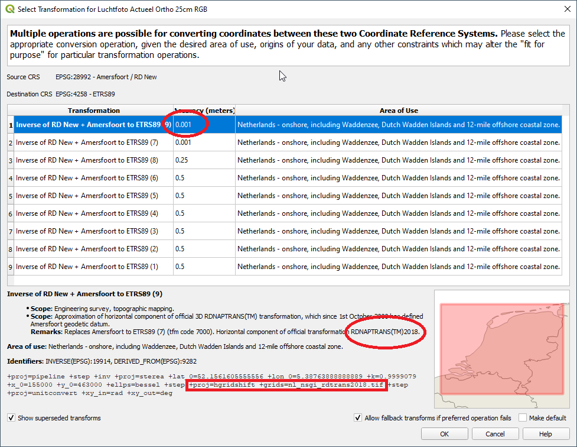

## Aandachtspunten voor CRS gebruik

Dit hoofdstuk gaat in op gebruik van de beschreven CRS-en. 

### Aandachtspunten bij CRS in informatiemodel en informatieketen

In een informatiemodel voor geo-informatie worden regels opgenomen voor het te gebruiken CRS(-en). 

#### Aandachtspunten t.a.v. CRS-keuze
Bij het opstellen van het informatiemodel is de aanbeveling om te inventariseren welke CRS-en al gebruikt worden in het domein en waarom. Dit kan leiden tot verschillende keuzes in de implementatie, zoals te zien in het voorbeeld voor BGT, BRO en DSO.

_VOORBEELD_ 
Het gebruik van CRS-en in de keten van inwinning tot uitwisseling en visualisatie van de Basisregistratie Grootschalige Topografie (BGT) kan als volgt worden geïnterpreteerd:

    [![](https://mermaid.ink/img/eyJjb2RlIjoiZ3JhcGggTFJcbiAgc3ViZ3JhcGggQnJvbmhvdWRlclxuICBzdWJncmFwaCBJbndpbm5pbmdcbiAgICBBMVtcIkVUUlM4OSA8YnI-IChHTlNTLVJUSylcIl0gXG4gICAgICAgIEEyW1wiUkQgPGJyPiAoTHVjaHRmb3RvKVwiXVxuICAgIEEzW1wiTG9rYWFsIDxicj4gKFRhY2h5bWV0cmllIDxicj4gTWVldGJhbmQpXCJdXG4gIGVuZFxuICBzdWJncmFwaCBWZXJ3ZXJraW5nIGVuIG9wc2xhZ1xuICAgIEJbUkRdXG4gIGVuZFxuICBlbmRcbiAgc3ViZ3JhcGggXCJMYW5kZWxpamtlIFZvb3J6aWVuaW5nXCJcbiAgc3ViZ3JhcGggXCJPcHNsYWcgTFZcIlxuICAgIEQxW1JEXVxuICBlbmRcbiAgZW5kXG4gIHN1YmdyYXBoIFwiRGF0YXBsYXRmb3JtIChQRE9LKVwiXG4gIHN1YmdyYXBoIFwiT3BzbGFnIFBET0tcIlxuICAgIERbUkRdXG4gIGVuZFxuICBlbmRcbiAgc3ViZ3JhcGggR2VicnVpa2VyXG4gIHN1YmdyYXBoIFZpc3VhbGlzYXRpZVxuICAgIEUxW0VUUlM4OV1cbiAgICBFMltSRF1cbiAgICBFM1tXR1M4NF1cbiAgZW5kXG4gIHN1YmdyYXBoIFwiRG93bmxvYWQgKEFwaS9BcHApXCJcbiAgICBFNFtSRF1cbiAgZW5kXG4gIGVuZFxuICBBMS0tPkJcbiAgQTItLT5CXG4gIEEzLS0-QlxuICBCLS0-fFVpdHdpc3NlbGluZ3xEMVxuICBEMS0tPnxVaXR3aXNzZWxpbmd8RFxuICBELS0-fFVpdHdpc3NlbGluZ3xFMVxuICBELS0-fFVpdHdpc3NlbGluZ3xFMlxuICBELS0-fFVpdHdpc3NlbGluZ3xFM1xuICBELS0-fFVpdHdpc3NlbGluZ3xFNCIsIm1lcm1haWQiOnt9LCJ1cGRhdGVFZGl0b3IiOmZhbHNlLCJhdXRvU3luYyI6ZmFsc2UsInVwZGF0ZURpYWdyYW0iOmZhbHNlfQ)](https://mermaid-js.github.io/mermaid-live-editor/edit/##eyJjb2RlIjoiZ3JhcGggTFJcbiAgc3ViZ3JhcGggQnJvbmhvdWRlclxuICBzdWJncmFwaCBJbndpbm5pbmdcbiAgICBBMVtcIkVUUlM4OSA8YnI-IChHTlNTLVJUSylcIl0gXG4gICAgICAgIEEyW1wiUkQgPGJyPiAoTHVjaHRmb3RvKVwiXVxuICAgIEEzW1wiTG9rYWFsIDxicj4gKFRhY2h5bWV0cmllIDxicj4gTWVldGJhbmQpXCJdXG4gIGVuZFxuICBzdWJncmFwaCBWZXJ3ZXJraW5nIGVuIG9wc2xhZ1xuICAgIEJbUkRdXG4gIGVuZFxuICBlbmRcbiAgc3ViZ3JhcGggXCJMYW5kZWxpamtlIFZvb3J6aWVuaW5nXCJcbiAgc3ViZ3JhcGggXCJPcHNsYWcgTFZcIlxuICAgIEQxW1JEXVxuICBlbmRcbiAgZW5kXG4gIHN1YmdyYXBoIFwiRGF0YXBsYXRmb3JtIChQRE9LKVwiXG4gIHN1YmdyYXBoIFwiT3BzbGFnIFBET0tcIlxuICAgIERbUkRdXG4gIGVuZFxuICBlbmRcbiAgc3ViZ3JhcGggR2VicnVpa2VyXG4gIHN1YmdyYXBoIFZpc3VhbGlzYXRpZVxuICAgIEUxW0VUUlM4OV1cbiAgICBFMltSRF1cbiAgICBFM1tXR1M4NF1cbiAgZW5kXG4gIHN1YmdyYXBoIFwiRG93bmxvYWQgKEFwaS9BcHApXCJcbiAgICBFNFtSRF1cbiAgZW5kXG4gIGVuZFxuICBBMS0tPkJcbiAgQTItLT5CXG4gIEEzLS0-QlxuICBCLS0-fFVpdHdpc3NlbGluZ3xEMVxuICBEMS0tPnxVaXR3aXNzZWxpbmd8RFxuICBELS0-fFVpdHdpc3NlbGluZ3xFMVxuICBELS0-fFVpdHdpc3NlbGluZ3xFMlxuICBELS0-fFVpdHdpc3NlbGluZ3xFM1xuICBELS0-fFVpdHdpc3NlbGluZ3xFNCIsIm1lcm1haWQiOiJ7fSIsInVwZGF0ZUVkaXRvciI6ZmFsc2UsImF1dG9TeW5jIjpmYWxzZSwidXBkYXRlRGlhZ3JhbSI6dHJ1ZX0)

Bij de inwinning van de BGT worden ETRS89, RD en lokale CRS-en gebruikt. Voor de opslag bij bronhouders, de Landelijke Voorziening en het dataplatform wordt voor de uitwisseling het CRS RD gebruikt. Voor uitwisseling tussen dataplatform en gebruiker worden het Nederlandse RD, het Europese ETRS89 en het wereldwijde 3D WGS 84 gebruikt. Hierbij zijn voor de visualisatie van ETRS89 en 3D WGS 84 verschillende kaartprojecties mogelijk. 

Voor de BRO is de keten echter anders:

[![](https://mermaid.ink/img/eyJjb2RlIjoiZ3JhcGggTFJcbiAgc3ViZ3JhcGggQnJvbmhvdWRlclxuICAgIHN1YmdyYXBoIElud2lubmluZ1xuICAgICAgQTFbXCJSRFwiXSBcbiAgICAgIEEyW1wiRVRSUzg5XCJdXG4gICAgICBBM1tcIldHUzg0XCJdXG4gICAgZW5kXG4gIGVuZFxuICBzdWJncmFwaCBcIkxhbmRlbGlqa2UgVm9vcnppZW5pbmdcIlxuICAgIHN1YmdyYXBoIFwiSW50YWtlIExWXCJcbiAgICAgIEIxW1wiUkRcIl0gXG4gICAgICBCMltcIkVUUlM4OVwiXVxuICAgICAgQjNbXCJXR1M4NFwiXVxuICAgIGVuZFxuICAgIHN1YmdyYXBoIFwiT3BzbGFnIExWXCJcbiAgICAgIEI0W0VUUlM4OV1cbiAgICBlbmRcbiAgZW5kXG4gIHN1YmdyYXBoIFwiRGF0YXBsYXRmb3JtIChQRE9LKVwiXG4gICAgc3ViZ3JhcGggXCJPcHNsYWcgUERPS1wiXG4gICAgICBEW0VUUlM4OV1cbiAgICBlbmRcbiAgZW5kXG4gIHN1YmdyYXBoIEdlYnJ1aWtlclxuICAgIHN1YmdyYXBoIFZpc3VhbGlzYXRpZVxuICAgICAgRTFbRVRSUzg5XVxuICAgICAgRTJbUkRdXG4gICAgICBFM1tXR1M4NF1cbiAgICBlbmRcbiAgICBzdWJncmFwaCBcIkRvd25sb2FkIChBdG9tKVwiXG4gICAgICBFNFtFVFJTODldXG4gICAgZW5kXG4gICAgc3ViZ3JhcGggXCJCUk8gTG9rZXRcIlxuICAgICAgICBGMVtFVFJTODldXG4gICAgZW5kXG4gIGVuZFxuICBBMS0tPkIxXG4gIEEyLS0-QjJcbiAgQTMtLT5CM1xuICBCMS0tPnxUcmFuc2Zvcm1hdGllfEI0XG4gIEIyLS0-QjRcbiAgQjMtLT58VHJhbnNmb3JtYXRpZXxCNFxuICBCNC0tPnxVaXR3aXNzZWxpbmd8RFxuICBELS0-fFVpdHdpc3NlbGluZ3xFMVxuICBELS0-fFVpdHdpc3NlbGluZ3xFMlxuICBELS0-fFVpdHdpc3NlbGluZ3xFM1xuICBELS0-fFVpdHdpc3NlbGluZ3xFNFxuICBCNCAtLT58VWl0d2lzc2VsaW5nfEYxXG5cbiIsIm1lcm1haWQiOnsidGhlbWUiOiJkZWZhdWx0In0sInVwZGF0ZUVkaXRvciI6ZmFsc2UsImF1dG9TeW5jIjp0cnVlLCJ1cGRhdGVEaWFncmFtIjpmYWxzZX0)](https://mermaid-js.github.io/mermaid-live-editor/edit/#eyJjb2RlIjoiZ3JhcGggTFJcbiAgc3ViZ3JhcGggQnJvbmhvdWRlclxuICAgIHN1YmdyYXBoIElud2lubmluZ1xuICAgICAgQTFbXCJSRFwiXSBcbiAgICAgIEEyW1wiRVRSUzg5XCJdXG4gICAgICBBM1tcIldHUzg0XCJdXG4gICAgZW5kXG4gIGVuZFxuICBzdWJncmFwaCBcIkxhbmRlbGlqa2UgVm9vcnppZW5pbmdcIlxuICAgIHN1YmdyYXBoIFwiSW50YWtlIExWXCJcbiAgICAgIEIxW1wiUkRcIl0gXG4gICAgICBCMltcIkVUUlM4OVwiXVxuICAgICAgQjNbXCJXR1M4NFwiXVxuICAgIGVuZFxuICAgIHN1YmdyYXBoIFwiT3BzbGFnIExWXCJcbiAgICAgIEI0W0VUUlM4OV1cbiAgICBlbmRcbiAgZW5kXG4gIHN1YmdyYXBoIFwiRGF0YXBsYXRmb3JtIChQRE9LKVwiXG4gICAgc3ViZ3JhcGggXCJPcHNsYWcgUERPS1wiXG4gICAgICBEW0VUUlM4OV1cbiAgICBlbmRcbiAgZW5kXG4gIHN1YmdyYXBoIEdlYnJ1aWtlclxuICAgIHN1YmdyYXBoIFZpc3VhbGlzYXRpZVxuICAgICAgRTFbRVRSUzg5XVxuICAgICAgRTJbUkRdXG4gICAgICBFM1tXR1M4NF1cbiAgICBlbmRcbiAgICBzdWJncmFwaCBcIkRvd25sb2FkIChBdG9tKVwiXG4gICAgICBFNFtFVFJTODldXG4gICAgZW5kXG4gICAgc3ViZ3JhcGggXCJCUk8gTG9rZXRcIlxuICAgICAgICBGMVtFVFJTODldXG4gICAgZW5kXG4gIGVuZFxuICBBMS0tPkIxXG4gIEEyLS0-QjJcbiAgQTMtLT5CM1xuICBCMS0tPnxUcmFuc2Zvcm1hdGllfEI0XG4gIEIyLS0-QjRcbiAgQjMtLT58VHJhbnNmb3JtYXRpZXxCNFxuICBCNC0tPnxVaXR3aXNzZWxpbmd8RFxuICBELS0-fFVpdHdpc3NlbGluZ3xFMVxuICBELS0-fFVpdHdpc3NlbGluZ3xFMlxuICBELS0-fFVpdHdpc3NlbGluZ3xFM1xuICBELS0-fFVpdHdpc3NlbGluZ3xFNFxuICBCNCAtLT58VWl0d2lzc2VsaW5nfEYxXG5cbiIsIm1lcm1haWQiOiJ7XG4gIFwidGhlbWVcIjogXCJkZWZhdWx0XCJcbn0iLCJ1cGRhdGVFZGl0b3IiOmZhbHNlLCJhdXRvU3luYyI6dHJ1ZSwidXBkYXRlRGlhZ3JhbSI6ZmFsc2V9)

Bij de BRO kunnen bronhouders in verschillende CRS-en aanbieden. Bij intake in de landelijke voorziening wordt getransformeerd naar ETRS89. Voor uitwisseling tussen dataplatform en gebruiker worden het Nederlandse RD, het Europese ETRS89 en het wereldwijde 3D WGS 84 gebruikt. Hierbij zijn voor de visualisatie van ETRS89 en 3D WGS 84 verschillende kaartprojecties mogelijk.  

Bij DSO zijn weer andere keuzes gemaakt, waaronder het dubbel opslaan van data in twee CRS-en:

#### Aandachtspunten t.a.v. informatie over CRS-en
In het informatiemodel wordt bij voorkeur de volgende informatie meegegeven:

- In welk(e) CRS(-en) mogen gegevens worden aangeleverd en opgevraagd.
- In welk(e) CRS(-en) worden gegevens opgeslagen.
- Waar eventueel coördinaatformaties plaatsvinden, bijvoorbeeld bij uitwisseling tussen dataplatform en gebruiker.
- Hoe informatie over het bron CRS en de gebruikte transformaties wordt opgeslagen bij gebruik van meerdere CRS-en.
- De numerieke precisie van coördinaten in het model.

De volgende tabel geeft de link naar voorbeelden van het specificeren van het CRS in informatiemodellen:

|Informatiemodel|Soort specificatie|Link|
|---|---|---|
|Omgevingswet|Gebruik van RD en ETRS89 in GML-bestanden|https://geonovum.github.io/TPOD/CIMOW/IMOW_v2.0.0.pdf#page=15|
|BRO Booronderzoek|2D: Gebruik van ETRS89 voor opslag, aanlevering toegestaan in RD, ETRS89 en WGS 84|https://docs.geostandaarden.nl/bro/bhr-g/#referentiestelsels-voor-de-horizontale-positie|

#### Aandachtspunten t.a.v. dubbel opslaan of on-the-fly transformeren
Bij het ontwerp van het informatiemodel, landelijke voorziening of dataportaal kan de afweging worden gemaakt om datumtransformaties op verschillende plaatsen in de keten te laten plaatsvinden en data dubbel op te slaan of juist de transformaties on-the-fly uit te voeren. Aandachtspunten bij deze afweging zijn onder andere de authenticiteit van gegevens en de kostenafweging tussen dubbel opslaan en (herhaaldelijk) on-the-fly transformeren. 

#### Nauwkeurigheid van coördinaten

De nauwkeurigheid van coördinaten moet minstens de nauwkeurigheid realiseren die vermeld wordt in het informatiemodel of bijgeleverde inwinningseisen. Meestal is het aantal decimalen dat in software standaard wordt opgeleverd groter. Deze decimalen hebben dan geen betekenis meer. Om te voorkomen dat er te grote databestanden ontstaan wordt aanbevolen de coördinaten af te ronden op 1 decimaal meer dan de nauwkeurigheid van de dataset vereist. Hierdoor kunnen fouten bij herhaaldelijk heen en weer transformeren worden voorkomen.

_VOORBEELD_ zoals opgenomen in [IMOW](https://geonovum.github.io/TPOD/CIMOW/IMOW_v2.0.0.pdf#page=15) en het [model Basisgeometrie](https://docs.geostandaarden.nl/nen3610/def-st-basisgeometrie-20200930/#nauwkeurigheid-van-coordinaten)

Coördinaten opgenomen bij een geometrie worden standaard uitgewisseld met een getalsnauwkeurigheid van 1 mm of het equivalent daarvan in graden. Voor RD, NAP
en ETRS89 komt dat overeen met de volgende nauwkeurigheden:

- RD in meters 3 decimalen (1 mm);  
- NAP-hoogte in meters 3 decimalen (1 mm);  
- ETRS89-breedte in graden 8 decimalen (1,1 mm);  
- ETRS89-lengte in graden 8 decimalen (0,7 mm);  
- ETRS89-hoogte in meters 3 decimalen (1 mm).

Alles wat nauwkeuriger is wordt afgerond op deze nauwkeurigheid van 3 of 8
decimalen. Afronding is volgens de volgende regel:  
0.0015 -\> 0.002;  
0.0014 -\> 0.001.

### Aandachtspunten bij meerdere CRS-en
Bij het gebruik van meerdere CRS-en bestaat risico op introductie van fouten door onjuiste implementatie van de relaties tussen CRS-en. Eindgebruikers worden geadviseerd data waar mogelijk op te vragen in hetzelfde CRS.

_ADVIES_ Vraag als eindgebruiker data zoveel mogelijk op in hetzelfde CRS.

Aanbieders van data worden geadviseerd om data aan te bieden in de verschillende CRS-en gericht op de eindgebruikers. Hierbij is het advies zo nauwkeurig mogelijk te transformeren, omdat het niet altijd duidelijk is wie de eindgebruiker is.

_ADVIES_ Biedt data aan in CRS-en gericht op het eindgebruik en transformeer hierbij eenduidig en zo nauwkeurig mogelijk.

Wanneer voor opslag, uitwisseling en/of visualisatie andere CRS-en worden gebruikt zijn er een aantal aandachtspunten, de belangrijkste zijn:

- Voorkom dat te grote geometrische of topologische verschillen ontstaan
- Maak gebruik van een eenduidige coördinaatransformatie (en leg dit vast)

##### Vormvastheid

Een rechte lijn in werkelijkheid is meestal geen rechte lijn in een kaart, maar een lijn die licht krom loopt. Om er voor te zorgen dat een begrenzing in de kaart ongeacht de kaartprojectie met voldoende nauwkeurigheid eenduidig is heeft de NSGI hiervoor een [advies](https://forum.pdok.nl/uploads/default/original/2X/c/c0795baa683bf3845c866ae4c576a880455be02a.pdf) geformuleerd. In dit advies staat dat lange lijnsegmenten van grenzen voorzien moeten worden van synthetische tussenpunten om bij coördinaatransformatie grote geometrische en topologische verandering van de data te voorkomen. De afstand tussen deze tussenpunten is afhankelijk van de acceptabele afwijking en de locatie op aarde. Voor Europees Nederland inclusief EEZ kan de volgende tabel worden gehanteerd:

|Acceptabele afwijking|Advies lijnlengte|
|----|----|
|1 mm	                 |200 m   |
|1 cm                    |500 m   |
|1 dm                    |2 km    |
|1 m                     |5 km    |
|10 m                    |20 km   |
|100 m                   |50 km   |

Voor een nauwkeurigheid van 1 mm zijn dus punten met 200 m tussenafstand nodig voor de in Nederland gangbare projecties. 

_ADVIES_ Wanneer lijnen worden getransformeerd met behulp van RDNAPTRANS™ gebruik dan geen lijnsegmenten die langer zijn dan 200 meter om de lijnen eenduidig te transformeren met de nauwkeurigheid van RDNAPTRANS™.

#### Aandachtspunten bij coördinatentransformatie
De relatie tussen CRS-en is vastgelegd in een [coördinatentransformatie](#coordinatentransformatie-datumtransformatie-en-coordinatenconversie). De relaties RD/NAP, ETRS89, ITRS en 3D WGS 84 zijn weergegeven in onderstaande figuur met daarbij de organisatie die de gegevens van coördinatentransformatie beheerd.

In de volgende paragrafen worden de coördinatentransformatie tussen RD en ETRS89 en tussen ETRS89 en WGS 84 beschreven.

##### Transformatie en conversie tussen RD/NAP en ETRS89
Bij de koppeling tussen ETRS89 en RD in de jaren 1990 werden systematische verschillen gevonden. Vanwege de wens van gebruikers dat RD-coördinaten niet wijzigden bij de introductie van ETRS89, is er voor gekozen om de verschillen te modelleren in correctiegrid, dat deel uitmaakt van de coördinatentransformatie procedure tussen geprojecteerde RD-coördinaten en geografische ETRS89-coördinaten. NAP hoogten kunnen met een quasi-geoïdemodel naar ellipsoïdische hoogten in ETRS89 worden getransformeerd met een precisie die hoger is dan de ETRS89-coördinaten die met de meeste GNSS-metingen wordt verkregen. Het correctiegrid en quasi-geoïdemodel zijn onderdeel van de procedure RDNAPTRANS™. 

RDNAPTRANS™ kent verschillende versies, in veel (oudere) GIS-pakketten en andere software is RDNAPTRANS™ niet volledig geïmplementeerd, wat fouten op decimeterniveau oplevert. Met de publicatie van RDNAPTRANS™ 2018 is een versie beschikbaar gekomen die voor aanbieders van software eenvoudiger te implementeren is. In de regel blijven de oudere versies ook beschikbaar in software, waarmee het voor gebruikers belangrijk is om goed te weten welke transformatie zij het meeste kunnen gebruiken in hun software. De NSGI publiceert de actuele procedure RDNAPTRANS™ en transformatievalidatieservice op haar [website]([[NSGI]]). Voor de transformatie tussen RD/NAP en ETRS89 met gebruik van de RDNAPTRANS™ procedure is tevens een [transformatie-API](https://www.nsgi.nl/coordinatentransformatie-api) beschikbaar bij de NSGI. Voorbeelden van implementatie van RDNAPTRANS™ in software wordt gegeven in de paragraaf [CRS in software](#crs-in-software).

_ADVIES_  Voor de uitwisseling van geo-informatie binnen Europa is het nadrukkelijke advies om altijd de weg via ETRS89 te kiezen. Bij gebruik van de actuele RDNAPTRANS™ procedure is daarbij voor het Nederlandse deel een nauwkeurigheid op centimeterniveau gewaarborgd. 

##### Transformatie tussen ETRS89 en ITRS/WGS 84
Wanneer na zorgvuldige afweging gebruik wordt gemaakt van WGS 84 of ITRS voor visualisatie of uitwisseling zijn verschillende strategieën mogelijk.

* **[WGS 84 gelijkstellen aan ETRS89](#wgs-84-gelijkstellen-aan-etrs89)**. Dit is de juiste keuze als er geen expliciete realisatie of epoche van WGS 84 wordt gebruikt.
* **[Tijdsafhankelijke transformatie tussen ETRS89 en ITRS/WGS 84](#tijdsafhankelijke-transformatie-tussen-etrs89-en-itrs-wgs-84)**. Dit is de juiste keuze waneer wel een expliciete realisatie én epoche van ITRS of WGS 84 wordwn gebruikt.

Het is verstandig de gekozen strategie in de metadata te vermelden.
###### WGS 84 gelijkstellen aan ETRS89
Wanneer de brondata in RD of ETRS89 is en het beoogd gebruik van de data bestaat uit visualisatie of combinatie met andere datasets, kan worden gekozen om WGS 84 en ETRS89 aan elkaar gelijk te stellen. Dit is de standaard implementatie in meerdere GIS-paketten, namelijk dat zonder expliciete vermelding van de WGS 84 en ETRS89-realisaties een nultransformatie wordt gebruikt. De nauwkeurigheid van de nultransformatie is circa 2 meter. Door het toepassen van deze strategie moet het resultaat worden geïnterpreteerd als een CRS dat bestaat uit een ongedefinieerd datum met als coördinatensysteem lengte en breedte. Het voordeel van het gebruik van de nultransformatie is dat de transformatie niet tijdsafhankelijk is en coördinaten dus niet veranderen in de tijd.

Bij gebruik van data waarbij het aangegeven CRS WGS 84 (EPSG:4326) is zonder duidelijke informatie over het CRS van de brondata, de gebruikte transformaties, realisatie en/of het epoche moet de gebruiker er rekening mee houden dat de data systematische fouten in de orde van meters kan bevatten. De toepassing bepaald of dit acceptabel is of niet. 

###### Tijdsafhankelijke transformatie tussen ETRS89 en ITRS/WGS 84
Wanneer de dataspecificatie expliciet een realisatie en epoche van WGS 84 of ITRS benoemd, of data gecombineerd wordt met de actuele locatie van de eindgebruiker kan worden gekozen de transformatie tussen ETRS89 en WGS 84 uit te voeren met hoge nauwkeurigheid voor een specifieke realisatie op een specifiek epoche. Dergelijke transformaties zijn vaak niet standaard geïmplementeerd in GIS-software, waardoor de gebruiker zelf de juiste transformatie moet definiëren in de software. 

Voor Nederlandse data mag voor ETRS89 de realisatie ETRF2000 worden gekozen. Wanneer de WGS 84-realisatie niet is gespecificeerd, dan wordt de meest recente realisatie gekozen (2D/3D WGS 84 (G2139)) of de realisatie van het (gemiddelde) moment van inwinning van de dataset.

Om te kunnen transformeren worden de door [[EUREF]] gepubliceerde tijdsafhankelijke transformatieparameters tussen ETRF2000 en ITRS gebruikt [[EUREF-TN1]] die ook in EPSG zijn opgenomen. Bij deze transformatie wordt de WGS 84-realisatie dan gelijkgesteld aan de bijbehorende ITRS-realisatie (ITRF2014 voor WGS 84 (G2139)). De keuze van het epoche kan voortkomen uit de datum van inwinning, publicatiedatum of een expliciete specificatie en kan indien noodzakelijk per geometrie verschillend zijn.

_VOORBEELD_ Voor de uitwisseling van terrein- en obstakelgegevens voor de luchtvaart in Europa [specificeert Eurocontrol](https://www.eurocontrol.int/sites/default/files/2021-07/eurocontrol-tod-manual-ed-3-0.pdf#page=125) dat het horizontale referentiesysteem WGS 84 is. In de [handreiking bij deze specificatie](https://www.eurocontrol.int/sites/default/files/publication/files/20130204-do-spec-vol.2-v1.0.pdf#page=16) wordt aangegeven dat WGS 84 voor deze toepassing wordt gelijkgesteld aan ITRF2000 op epoche 2000.0.

Indien de publicatiedatum van de dataset wordt gekozen als epoche voor de transformatie worden bij regelmatige updates (bijvoorbeeld jaarlijks) de WGS 84/ITRS coördinaten bijgesteld als gevolg van de platentektoniek. Wanneer als epoche de (gemiddelde) datum van de inwinning van de dataset, komen de coördinaten gemiddeld het best overeen met de WGS 84/ITRS coördinaten op het moment van inwinning. 

_ADVIES_ Wanneer een coördinatentransformatie plaatsvindt in de keten van inwinning tot gebruik is het advies de gekozen transformatieprocedure in het model en/of metadata op te nemen. Bij tijdsafhankelijke transformaties, zoals van ETRS89 naar WGS 84 moet dan ook het referentieepoche worden opgenomen. Tussen RD/NAP en ETRS89 is het van belang gebruik te maken van de RDNAPTRANS™ procedure. 

_VOORBEELD_
In het informatiemodel van de BRO is gekozen voor het opnemen van het attribuut [Coördinaattransformatie](https://docs.geostandaarden.nl/bro/bhr-g/#detail_class_Model_Cordinaattransformatie) waarin in de waardelijst de mogelijke transformaties zijn vastgelegd.

### CRS bij uitwisselingsformaten

Niet alle uitwisselingsformaten ondersteunen (volledig) het gebruik van meerdere CRS-en. De [Handreiking Geometrie in uitwisselingsformaten](https://geonovum.github.io/geox/) geeft een keuzehulp van gebruik van uitwisselingsformaten voor 2D vector bestanden, waarin ook de ondersteuning van CRS-en is opgenomen. De tabel hieronder geeft een samenvatting van de ondersteuning van CRS-en voor deze formaten.

|CRS|URN|[HTML](https://geonovum.github.io/geox/#html)|[GeoJSON](https://geonovum.github.io/geox/#geojson)|[GeoPackage](https://geonovum.github.io/geox/#geopackage)|[GML](https://geonovum.github.io/geox/#gml)|[RDF](https://geonovum.github.io/geox/#rdf)|
|---|---|---|---|---|---|---|
|RD|urn:ogc:def:crs:EPSG::28992|&#10005;|&#65374;|&#10003;|&#10003;|&#10003;|
|ETRS89|urn:ogc:def:crs:EPSG::4258|&#10005;|&#65374;|&#10003;|&#10003;|&#10003;|
|3D WGS 84|urn:ogc:def:crs:EPSG::4326|&#10003;|&#10003;|&#10003;|&#10003;|&#10003;|
|Web-Mercator|urn:ogc:def:crs:EPSG::3857|&#10005;|&#65374;|&#10003;|&#10003;|&#10003;|

De tabel laat zien dat de eenvoudige formaten HTML en GeoJSON alleen WGS 84 ondersteunen. In het geval dat een formaar alleen WGS 84 ondersteund moet dit worden geïnterpreteerd als een ongedefinieerd CRS met geografische coördinaten en lage nauwkeurigheid, omdat bijvoorbeeld een [nultransformatie](#wgs-84-gelijkstellen-aan-etrs89) kan zijn toegepast. Voor veel toepassingen op het web voldoet deze lagere nauwkeurigheid. De andere formaten ondersteunen meerdere CRS-en, ook de CRS-en die niet im deze tabel zijn opgenomen, maar wel zijn gegeven in [Bijlage A](#bijlage-a-crs-overzicht-tabel).

#### Gebruik van andere CRS-en in GeoJSON

Voor GeoJSON zijn in bovenstaande tabel tildes aangegeven voor andere CRS-en. ....

#### GeoTIFF, WFS, OGC API??

### Aandachtspunten  bij toepassing in software

Diverse software (bibliotheken) ondersteunen het gebruik van meerdere CRS-en. Deze paragraaf geeft een aantal voorbeelden en is zeker niet volledig.

#### Voor ontwikkelaars: PROJ

[PROJ](https://proj.org) is een open source softwarebibliotheek voor datumtransformaties en coördinaatconversies, tot februari 2018 was de software bekend onder de naam PROJ.4. PROJ heeft zich ontwikkeld van een software voor conversie van coördinaten tot een software voor geodetische datumtransformaties en coördinaatconversies. In versie PROJ 8.1.1 worden RDNAPTRANS™ en tijdsafhankelijke transformaties ondersteund, versies gebaseerd op PROJ.4 (voor 2018) hebben deze ondersteuning niet. PROJ wordt onder andere gebruikt in de bibliotheek voor het omzetten van dataformaten [GDAL](https://gdal.org) en de open-source GIS-software [QGIS](https://qgis.org).
#### Voor gebruikers: QGIS

[QGIS](https://www.qgis.org/) is een open source GIS-software. De ondersteuning van datumtransformaties en coördinaatconversies is gebaseerd op PROJ. QGIS kan ook worden gebruikt om conform het langelijnenadvies tussenpunten volgens een rechte lijn in de kaartprojectie te berekenen. Het berekenen van tussenpunten volgens een rechte lijn in werkelijkheid (geodetische lijn) volgens het [langelijnenadvies](#geometrie-en-topologie) is minder eenvoudig, maar kan wel met een speciale functie van PROJ.

_VOORBEELD_ QGIS 3.20 bevat diverse implementaties van de transformatie tussen RD en ETRS89 die zijn opgenomen in de EPSG-database. Zodra in een project RD en ETRS89 worden gebruikt verschijnt een pop-up met de vraag welke transformatie moet worden gebruikt, behalve wanneer de gebruiker al een default heeft geconfigureerd. De meest nauwkeurige transformatie, in het geval van QGIS 3.20 is dat de 2D implementatie van RDNAPTRANS™, wordt als eerste getoond. In onderstaande figuur wordt het pop-up scherm getoond.

<figure id="plaatje">
    
    <figcaption>Keuzescherm voor transformatie tussen RD en ETRS89 in QGIS.</figcaption>
</figure>

De in rood omleidende elementen in de pop-up duiden hier op het gebruik van RDNAPTRANS™, bijvoorbeeld de hoge nauwkeurigheid van de transformatie (0.001 m), de verwijzing naar RDNAPTRANS™2018 in de omschrijving en het gebruik van het correctiegrid in de PROJ-string.

