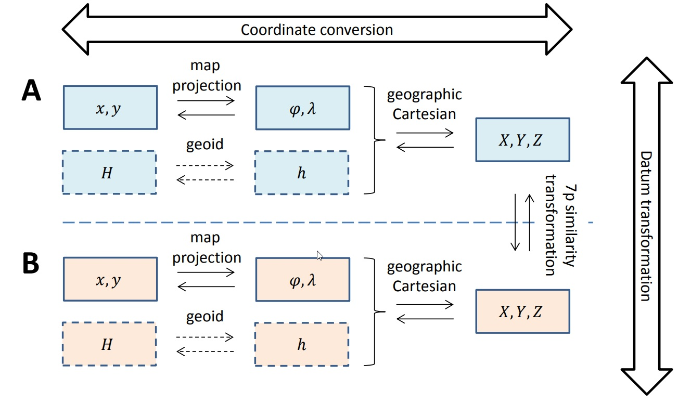

## CRS gebruik

Dit hoofdstuk gaat in op gebruik van de beschreven CRS-en. 

Paragraaf 3.1, 3.2 en 3.4.1 (deels) naar begin hooftuk 2? en er hier bij de inleiding naar terugverwijzen?

### Opbouw van CRS

Een CRS is opgebouwd uit een datum en een coördinaatsysteem. Het coördinaatsysteem definieert hoe coördinaten worden uitgedrukt, bijvoorbeeld cartesisch of geografisch. Het datum geeft de relatie van het coördinaatsysteem met de vorm van de aarde en het aardoppervlak. RD en NAP zijn beide een CRS, de combinatie van RD en NAP is een samengesteld (engels: compound) CRS.

_VOORBEELD_ RD/NAP is het samengestelde CRS uit RD en NAP. Schematisch wordt dit als volgt weergegeven:
[](https://mermaid-js.github.io/mermaid-live-editor/edit#eyJjb2RlIjoiZ3JhcGggXG4gICAgQVtcIlNhbWVuZ2VzdGVsZCBDUlM8YnIgLz5SRE5BUFwiXVxuICAgIEJbQ1JTPGJyIC8-UkRdXG4gICAgQ1tDUlM8YnIgLz5OQVBdXG4gICAgQjFbXCJHZW9kZXRpc2NoIGRhdHVtPGJyIC8-UkQgQmVzc2VsXCJdXG4gICAgQjJbXCJDb29yZGluYXRlbnN5c3RlZW08YnIgLz5EdWJiZWxwcm9qZWN0aWUgdmFuIFNjaHJlaWJlcjxiciAvPk5vdGF0aWU6IHgseSBbbV1cIl1cbiAgICBDMVtcIlZlcnRpa2FhbCBkYXR1bTxiciAvPk5BUFwiXVxuICAgIEMyW1wiQ29vcmRpbmF0ZW5zeXN0ZWVtPGJyIC8-T3J0aG9tZXRyaXNjaGUgaG9vZ3RlbjxiciAvPk5vdGF0aWU6IEggW21dXCJdXG4gIEEtLS1CXG4gIEEtLS1DXG4gIEItLS1CMVxuICBCLS0tQjJcbiAgQy0tLUMxXG4gIEMtLS1DMlxuICAiLCJtZXJtYWlkIjoie1xuICBcInRoZW1lXCI6IFwiZGVmYXVsdFwiXG59IiwidXBkYXRlRWRpdG9yIjpmYWxzZSwiYXV0b1N5bmMiOnRydWUsInVwZGF0ZURpYWdyYW0iOmZhbHNlfQ)

### Naamgeving van CRS

CRS-en worden in de praktijk op verschillende manieren aangeduid. In hoofdstuk 2 zijn de officiële benamingen gebruikt, bij opslag en uitwisseling van geo-informatie wordt vaak gebruik gemaakt van gestandaardiseerde aanduiding van de CRS-en in de vorm van een OGC URN of Name Type Specification (NTS) voor CRS-en. Deze hebben de volgende structuur:

|Type aanduiding|structuur|
|----|----|
|URN|urn:ogc:def:crs:_authority_:_version_:_code_|
|NTS|http://www.opengis.net/def/crs/_authority_/_version_/_code_|
|NTS|http://www.opengis.net/def/crs?authority=_authority_&version=_version_&code=_code_|

In deze aanduiding wordt meestal EPSG als de-facto autoriteit gebruikt, maar ook ISO is een voorbeeld van een autoriteit. Bij gebruik van de laatste versie van de database van de authority wordt bij URN _version_ leeg gelaten, terwijl bij de NTS _version_=0 wordt gebruikt. In [Bijlage A](#crs-overzicht-tabel) is een tabel opgenomen met de EPSG-codes voor veelgebruikte CRS-en in Nederland. Met behulp van deze tabel kan de URN en NTS worden afgeleidt, bijvoorbeeld voor het RD (EPSG:code 28992), resulteert dit in de volgende aanduidingen.

|Type aanduiding|structuur|
|----|----|
|URN|urn:ogc:def:crs:EPSG::28992|
|NTS|http://www.opengis.net/def/crs/ESPG/0/28992|
|NTS|http://www.opengis.net/def/crs?authority=EPSG&version=0&code=28992|

### CRS in het informatiemodel

In een informatiemodel voor geo-informatie worden regels opgenomen voor het te gebruiken CRS(-en). Bij het opstellen van het informatiemodel is de aanbeveling om te inventariseren welke CRS-en al gebruikt worden in het domein en waarom. Dit kan leiden tot verschillende keuzes in de implementatie, zoals te zien in het voorbeeld voor BGT, BRO en DSO.

_VOORBEELD_ 
Het gebruik van CRS-en in de keten van inwinning tot uitwisseling en visualisatie van de Basisregistratie Grootschalige Topografie (BGT) kan als volgt worden geïnterpreteerd:

    [![](https://mermaid.ink/img/eyJjb2RlIjoiZ3JhcGggTFJcbiAgc3ViZ3JhcGggQnJvbmhvdWRlclxuICBzdWJncmFwaCBJbndpbm5pbmdcbiAgICBBMVtcIkVUUlM4OSA8YnI-IChHTlNTLVJUSylcIl0gXG4gICAgICAgIEEyW1wiUkQgPGJyPiAoTHVjaHRmb3RvKVwiXVxuICAgIEEzW1wiTG9rYWFsIDxicj4gKFRhY2h5bWV0cmllIDxicj4gTWVldGJhbmQpXCJdXG4gIGVuZFxuICBzdWJncmFwaCBWZXJ3ZXJraW5nIGVuIG9wc2xhZ1xuICAgIEJbUkRdXG4gIGVuZFxuICBlbmRcbiAgc3ViZ3JhcGggXCJMYW5kZWxpamtlIFZvb3J6aWVuaW5nXCJcbiAgc3ViZ3JhcGggXCJPcHNsYWcgTFZcIlxuICAgIEQxW1JEXVxuICBlbmRcbiAgZW5kXG4gIHN1YmdyYXBoIFwiRGF0YXBsYXRmb3JtIChQRE9LKVwiXG4gIHN1YmdyYXBoIFwiT3BzbGFnIFBET0tcIlxuICAgIERbUkRdXG4gIGVuZFxuICBlbmRcbiAgc3ViZ3JhcGggR2VicnVpa2VyXG4gIHN1YmdyYXBoIFZpc3VhbGlzYXRpZVxuICAgIEUxW0VUUlM4OV1cbiAgICBFMltSRF1cbiAgICBFM1tXR1M4NF1cbiAgZW5kXG4gIHN1YmdyYXBoIFwiRG93bmxvYWQgKEFwaS9BcHApXCJcbiAgICBFNFtSRF1cbiAgZW5kXG4gIGVuZFxuICBBMS0tPkJcbiAgQTItLT5CXG4gIEEzLS0-QlxuICBCLS0-fFVpdHdpc3NlbGluZ3xEMVxuICBEMS0tPnxVaXR3aXNzZWxpbmd8RFxuICBELS0-fFVpdHdpc3NlbGluZ3xFMVxuICBELS0-fFVpdHdpc3NlbGluZ3xFMlxuICBELS0-fFVpdHdpc3NlbGluZ3xFM1xuICBELS0-fFVpdHdpc3NlbGluZ3xFNCIsIm1lcm1haWQiOnt9LCJ1cGRhdGVFZGl0b3IiOmZhbHNlLCJhdXRvU3luYyI6ZmFsc2UsInVwZGF0ZURpYWdyYW0iOmZhbHNlfQ)](https://mermaid-js.github.io/mermaid-live-editor/edit/##eyJjb2RlIjoiZ3JhcGggTFJcbiAgc3ViZ3JhcGggQnJvbmhvdWRlclxuICBzdWJncmFwaCBJbndpbm5pbmdcbiAgICBBMVtcIkVUUlM4OSA8YnI-IChHTlNTLVJUSylcIl0gXG4gICAgICAgIEEyW1wiUkQgPGJyPiAoTHVjaHRmb3RvKVwiXVxuICAgIEEzW1wiTG9rYWFsIDxicj4gKFRhY2h5bWV0cmllIDxicj4gTWVldGJhbmQpXCJdXG4gIGVuZFxuICBzdWJncmFwaCBWZXJ3ZXJraW5nIGVuIG9wc2xhZ1xuICAgIEJbUkRdXG4gIGVuZFxuICBlbmRcbiAgc3ViZ3JhcGggXCJMYW5kZWxpamtlIFZvb3J6aWVuaW5nXCJcbiAgc3ViZ3JhcGggXCJPcHNsYWcgTFZcIlxuICAgIEQxW1JEXVxuICBlbmRcbiAgZW5kXG4gIHN1YmdyYXBoIFwiRGF0YXBsYXRmb3JtIChQRE9LKVwiXG4gIHN1YmdyYXBoIFwiT3BzbGFnIFBET0tcIlxuICAgIERbUkRdXG4gIGVuZFxuICBlbmRcbiAgc3ViZ3JhcGggR2VicnVpa2VyXG4gIHN1YmdyYXBoIFZpc3VhbGlzYXRpZVxuICAgIEUxW0VUUlM4OV1cbiAgICBFMltSRF1cbiAgICBFM1tXR1M4NF1cbiAgZW5kXG4gIHN1YmdyYXBoIFwiRG93bmxvYWQgKEFwaS9BcHApXCJcbiAgICBFNFtSRF1cbiAgZW5kXG4gIGVuZFxuICBBMS0tPkJcbiAgQTItLT5CXG4gIEEzLS0-QlxuICBCLS0-fFVpdHdpc3NlbGluZ3xEMVxuICBEMS0tPnxVaXR3aXNzZWxpbmd8RFxuICBELS0-fFVpdHdpc3NlbGluZ3xFMVxuICBELS0-fFVpdHdpc3NlbGluZ3xFMlxuICBELS0-fFVpdHdpc3NlbGluZ3xFM1xuICBELS0-fFVpdHdpc3NlbGluZ3xFNCIsIm1lcm1haWQiOiJ7fSIsInVwZGF0ZUVkaXRvciI6ZmFsc2UsImF1dG9TeW5jIjpmYWxzZSwidXBkYXRlRGlhZ3JhbSI6dHJ1ZX0)

Bij de inwinning van de BGT worden ETRS89, RD en lokale CRS-en gebruikt. Voor de opslag bij bronhouders, de Landelijke Voorziening en het dataplatform wordt voor de uitwisseling het CRS RD gebruikt. Voor uitwisseling en visualisatie worden tussen dataplatform en gebruiker ETRS89, RD en WGS84 gebruikt, waarbij voor ETRS89 en WGS84 verschillende projecties mogelijk zijn. 

Voor de BRO is de keten echter anders:

[![](https://mermaid.ink/img/eyJjb2RlIjoiZ3JhcGggTFJcbiAgc3ViZ3JhcGggQnJvbmhvdWRlclxuICAgIHN1YmdyYXBoIElud2lubmluZ1xuICAgICAgQTFbXCJSRFwiXSBcbiAgICAgIEEyW1wiRVRSUzg5XCJdXG4gICAgICBBM1tcIldHUzg0XCJdXG4gICAgZW5kXG4gIGVuZFxuICBzdWJncmFwaCBcIkxhbmRlbGlqa2UgVm9vcnppZW5pbmdcIlxuICAgIHN1YmdyYXBoIFwiSW50YWtlIExWXCJcbiAgICAgIEIxW1wiUkRcIl0gXG4gICAgICBCMltcIkVUUlM4OVwiXVxuICAgICAgQjNbXCJXR1M4NFwiXVxuICAgIGVuZFxuICAgIHN1YmdyYXBoIFwiT3BzbGFnIExWXCJcbiAgICAgIEI0W0VUUlM4OV1cbiAgICBlbmRcbiAgZW5kXG4gIHN1YmdyYXBoIFwiRGF0YXBsYXRmb3JtIChQRE9LKVwiXG4gICAgc3ViZ3JhcGggXCJPcHNsYWcgUERPS1wiXG4gICAgICBEW0VUUlM4OV1cbiAgICBlbmRcbiAgZW5kXG4gIHN1YmdyYXBoIEdlYnJ1aWtlclxuICAgIHN1YmdyYXBoIFZpc3VhbGlzYXRpZVxuICAgICAgRTFbRVRSUzg5XVxuICAgICAgRTJbUkRdXG4gICAgICBFM1tXR1M4NF1cbiAgICBlbmRcbiAgICBzdWJncmFwaCBcIkRvd25sb2FkIChBdG9tKVwiXG4gICAgICBFNFtFVFJTODldXG4gICAgZW5kXG4gICAgc3ViZ3JhcGggXCJCUk8gTG9rZXRcIlxuICAgICAgICBGMVtFVFJTODldXG4gICAgZW5kXG4gIGVuZFxuICBBMS0tPkIxXG4gIEEyLS0-QjJcbiAgQTMtLT5CM1xuICBCMS0tPnxUcmFuc2Zvcm1hdGllfEI0XG4gIEIyLS0-QjRcbiAgQjMtLT58VHJhbnNmb3JtYXRpZXxCNFxuICBCNC0tPnxVaXR3aXNzZWxpbmd8RFxuICBELS0-fFVpdHdpc3NlbGluZ3xFMVxuICBELS0-fFVpdHdpc3NlbGluZ3xFMlxuICBELS0-fFVpdHdpc3NlbGluZ3xFM1xuICBELS0-fFVpdHdpc3NlbGluZ3xFNFxuICBCNCAtLT58VWl0d2lzc2VsaW5nfEYxXG5cbiIsIm1lcm1haWQiOnsidGhlbWUiOiJkZWZhdWx0In0sInVwZGF0ZUVkaXRvciI6ZmFsc2UsImF1dG9TeW5jIjp0cnVlLCJ1cGRhdGVEaWFncmFtIjpmYWxzZX0)](https://mermaid-js.github.io/mermaid-live-editor/edit/#eyJjb2RlIjoiZ3JhcGggTFJcbiAgc3ViZ3JhcGggQnJvbmhvdWRlclxuICAgIHN1YmdyYXBoIElud2lubmluZ1xuICAgICAgQTFbXCJSRFwiXSBcbiAgICAgIEEyW1wiRVRSUzg5XCJdXG4gICAgICBBM1tcIldHUzg0XCJdXG4gICAgZW5kXG4gIGVuZFxuICBzdWJncmFwaCBcIkxhbmRlbGlqa2UgVm9vcnppZW5pbmdcIlxuICAgIHN1YmdyYXBoIFwiSW50YWtlIExWXCJcbiAgICAgIEIxW1wiUkRcIl0gXG4gICAgICBCMltcIkVUUlM4OVwiXVxuICAgICAgQjNbXCJXR1M4NFwiXVxuICAgIGVuZFxuICAgIHN1YmdyYXBoIFwiT3BzbGFnIExWXCJcbiAgICAgIEI0W0VUUlM4OV1cbiAgICBlbmRcbiAgZW5kXG4gIHN1YmdyYXBoIFwiRGF0YXBsYXRmb3JtIChQRE9LKVwiXG4gICAgc3ViZ3JhcGggXCJPcHNsYWcgUERPS1wiXG4gICAgICBEW0VUUlM4OV1cbiAgICBlbmRcbiAgZW5kXG4gIHN1YmdyYXBoIEdlYnJ1aWtlclxuICAgIHN1YmdyYXBoIFZpc3VhbGlzYXRpZVxuICAgICAgRTFbRVRSUzg5XVxuICAgICAgRTJbUkRdXG4gICAgICBFM1tXR1M4NF1cbiAgICBlbmRcbiAgICBzdWJncmFwaCBcIkRvd25sb2FkIChBdG9tKVwiXG4gICAgICBFNFtFVFJTODldXG4gICAgZW5kXG4gICAgc3ViZ3JhcGggXCJCUk8gTG9rZXRcIlxuICAgICAgICBGMVtFVFJTODldXG4gICAgZW5kXG4gIGVuZFxuICBBMS0tPkIxXG4gIEEyLS0-QjJcbiAgQTMtLT5CM1xuICBCMS0tPnxUcmFuc2Zvcm1hdGllfEI0XG4gIEIyLS0-QjRcbiAgQjMtLT58VHJhbnNmb3JtYXRpZXxCNFxuICBCNC0tPnxVaXR3aXNzZWxpbmd8RFxuICBELS0-fFVpdHdpc3NlbGluZ3xFMVxuICBELS0-fFVpdHdpc3NlbGluZ3xFMlxuICBELS0-fFVpdHdpc3NlbGluZ3xFM1xuICBELS0-fFVpdHdpc3NlbGluZ3xFNFxuICBCNCAtLT58VWl0d2lzc2VsaW5nfEYxXG5cbiIsIm1lcm1haWQiOiJ7XG4gIFwidGhlbWVcIjogXCJkZWZhdWx0XCJcbn0iLCJ1cGRhdGVFZGl0b3IiOmZhbHNlLCJhdXRvU3luYyI6dHJ1ZSwidXBkYXRlRGlhZ3JhbSI6ZmFsc2V9)

Bij de BRO kunnen bronhouders in verschillende CRS-en aanbieden. Bij intake in de landelijke voorziening wordt gertransformeerd naar ETRS89. Voor uitwisseling en visualisatie worden tussen dataplatform en gebruiker ETRS89, RD en WGS84 gebruikt, waarbij voor ETRS89 en WGS84 verschillende projecties mogelijk zijn. 

Bij DSO zijn weer andere keuzes gemaakt, waaronder het dubbel opslaan van data in twee CRS-en:

In het informatiemodel wordt bij voorkeur de volgende informatie meegegeven:

- In welk(e) CRS(-en) mogen gegevens worden aangeleverd en opgevraagd.
- In welk(e) CRS(-en) worden gegevens opgeslagen.
- Waar eventueel datumtransformatie en/of conversie plaatsvinden, bijvoorbeeld bij uitwisseling tussen dataplatform en gebruiker.
- Hoe informatie over het bron CRS en de gebruikte transformaties wordt opgeslagen bij gebruik van meerdere CRS-en.
- De numerieke precisie van coördinaten in het model.

De volgende tabel geeft de link naar voorbeelden van het specificeren van het CRS in informatiemodellen:

|Informatiemodel|Soort specificatie|Link|
|---|---|---|
|Omgevingswet|Gebruik van RD en ETRS89 in GML-bestanden|https://geonovum.github.io/TPOD/CIMOW/IMOW_v2.0.0.pdf#page=15|
|BRO Booronderzoek|2D: Gebruik van ETRS89 voor opslag, aanlevering toegestaan in RD, ETRS89 en WGS 84|https://docs.geostandaarden.nl/bro/bhr-g/#referentiestelsels-voor-de-horizontale-positie|

### Aandachtspunten bij gebruik van meerdere CRS-en

Bij het gebruik van meerdere CRS-en bestaat risico op introductie van fouten of verstoringen door onjuiste implementatie an de relaties tussen CRS-en. Eindgebruikers worden geadviseerd data waar mogeijk op te vragen in hetzelfde CRS.

_ADVIES_ Vraag als eindgebruiker data zoveel mogelijk op in hetzelfde CRS.

Aanbieder van data worden geadviseerd om data aan te bieden in de verschilende CRS-en gericht op de eindgebruikers. Hierbij is het advies zo nauwkeurig mogelijk te transformeren, omdat het niet altijd duidelijk is wie de eindgebruiker is.

_ADVIES_ Biedt data aan in CRS-en gericht op het eindgebruik en transformeer hierbij eenduidig en zo nauwkeurig mogelijk.

Wanneer voor opslag, uitwisseling en/of visualisatie andere CRS-en worden gebruikt zijn er een aantal aandachtspunten, de belangrijkste zijn:

- Maak gebruik van een eenduidige coördinatentransformatie en coördinatenconversie (en leg dit vast)
- Voorkom dat geometrische of topologische verschillen ontstaan
- Significantie van decimalen

#### Datumtransformatie en coördinatenconversie

Het veranderen van coördinaten van het ene CRS naar het andere CRS wordt datumtransformatie genoemd. Het uitdrukken van coördinaten in een ander coördinatensysteem, bijvoorbeeld van geografisch naar geprojecteerd, noemen we  coördinatenconversie. De relatie wordt afgebeeld in onderstaande figuur en verder uitgelegd in [bron](http://gnss1.tudelft.nl/pub/vdmarel/reader/CTB3310_RefSystems_1-2a_online.pdf#page=33).

<figure id="plaatje">
    
    <figcaption>Datumtransformaties en coördinatenconversies. Horizontale bewerkingen zijn coördinaatconversies. De verticale bewerkingen zijn datumtransformaties van systeem A naar B. Niet weergegeven in dit diagram zijn het gebruik van correctiegrids of polynoomtransformaties (benaderingen) direct tussen geprojecteerde coördinaten of geografische coördinaten van de twee systemen. <a href="http://gnss1.tudelft.nl/pub/vdmarel/reader/CTB3310_RefSystems_1-2a_online.pdf#page=33">bron</a>.</figcaption>
</figure>

_ADVIES_ Wanneer een datumtransformatie plaatsvindt in de keten van inwinning tot gebruik is het advies de gekozen transformatieparameters in het model en/of metadata op te nemen. Bij tijdsafhankelijke transformaties, zoals van ETRS89 naar WGS 84 moet dan ook het referentieepoche worden opgenomen. Tussen RD/NAP en ETRS89 is het van belang gebruik te maken van de RDNAPTRANS procedure. 

_VOORBEELD_
In het informatiemodel van de BRO is gekozen voor het opnemen van het attribuut [Coördinaattransformatie](https://docs.geostandaarden.nl/bro/bhr-g/#detail_class_Model_Cordinaattransformatie) waarin in de waardelijst de mogelijke transformaties zijn vastgelegd.

Bij het ontwerp van het informatiemodel, landelijke voorziening of dataportaal kan de afweging worden gemaakt om datumtransformaties op verschillende plaatsen in de keten te laten plaatsvinden en data dubbel op te slaan of juist de transformaties on-the-fly uit te voeren. Aandachtspunten bij deze afweging zijn onder andere de authenticiteit van gegevens en de kostenafweging tussen dubbel opslaan en (herhaaldelijk) on-the-fly transformeren. 

  
#### Geometrie en topologie

Een rechte lijn in werkelijkheid is meestal geen rechte lijn in een kaart, maar een lijn die licht krom loopt. Om er voor te zorgen dat een grens in de kaart ongeacht de kaartprojectie met voldoende nauwkeurigheid eenduidig is heeft de NSGI hiervoor een [advies](https://forum.pdok.nl/uploads/default/original/2X/c/c0795baa683bf3845c866ae4c576a880455be02a.pdf) geformuleerd. In dit advies staat dat lange lijnstukken van grenzen voorzien worden van tussenpunten. De afstand tussen deze tussenpunten is afhankelijk van de acceptabele lijnlengte en de locaties in Nederland, voor Europees Nederland inclusief EEZ kan de voglende tabel worden gehanteerd:

|Acceptabele afwijking|Advies lijnlengte|
|----|----|
|1 mm	                 |200 m   |
|1 cm                    |500 m   |
|1 dm                    |2 km    |
|1 m                     |5 km    |
|10 m                    |20 km   |
|100 m                   |50 km   |

Voor een nauwkeurigheid van 1 mm zijn dus punten met 200 m tussenafstand nodig voor de in Nederland gangbare projecties. 

_ADVIES_ Wanneer lijnen worden getransfomeerd met behulp van RDNAPTRANS mogen de lijnsegmenten niet langer zijn dan 200 meter om de geometrie eenduidig te transformeneren met de nauwkeurigheid van RDNAPTRANS.

#### Nauwkeurigheid van coördinaten

De nauwkeurigheid van de coördinaten opgenomen bij een geometrie moet minstens
de nauwkeurigheid realiseren die vermeld wordt in het informatiemodel of
bijgeleverde inwinningseisen. Meestal is het aantal decimalen dat in software
standaard wordt opgeleverd groter. Deze decimalen hebben dan geen betekenis
meer. Om te voorkomen dat er te grote databestanden ontstaan wordt aanbevolen de
coördinaten af te ronden op 1 decimaal meer dan de nauwkeurigheid van de dataset vereist. Hierdoor kunnen fouten bij herhaaldelijk heen en weer transformeren worden voorkomen.

_VOORBEELD_ zoals opgenomen in [IMOW](https://geonovum.github.io/TPOD/CIMOW/IMOW_v2.0.0.pdf#page=15) en het [model Basisgeometrie](https://docs.geostandaarden.nl/nen3610/def-st-basisgeometrie-20200930/#nauwkeurigheid-van-coordinaten)

Coördinaten opgenomen bij een geometrie worden standaard uitgewisseld met een getalsnauwkeurigheid van 1 mm of het equivalent daarvan in graden. Voor RD, NAP
en ETRS89 komt dat overeen met de volgende nauwkeurigheden:

- RD in meters 3 decimalen (1 mm);  
- NAP-hoogte in meters 3 decimalen (1 mm);  
- ETRS89-breedte in graden 8 decimalen (1,1 mm);  
- ETRS89-lengte in graden 8 decimalen (0,7 mm);  
- ETRS89-hoogte in meters 3 decimalen (1 mm).

Alles wat nauwkeuriger is wordt afgerond op deze nauwkeurigheid van 3 of 8
decimalen. Afronding is volgens de volgende regel:  
0.0015 -\> 0.002;  
0.0014 -\> 0.001.

### Ondersteuning van meerdere CRS-en in software(biliotheken)

Diverse software (bibliotheken) ondersteunen het gebruik van meerdere CRS-en. Deze paragraaf geeft een aantal voorbeelden en is zeker niet volledig.

#### PROJ

[PROJ](https://proj.org) is een open source softwarebiliotheek voor datumtransformaties en coördinaatconversies, tot februari 2018 was de software bekend onder de naam PROJ.4. PROJ heeft zih ontwikkeld van een software voor conversie van coördinaten tot een software voor geodetische datumtransformaties en coördinaatconversies. In versie PROJ 8.1.1 worden RDNAPTRANS en tijdsafhankelijke transformaties ondersteund, versies gebasseerd op PROJ.4 (voor 2018) hebben deze ondersteuning niet. PROJ wordt onder andere gebruikt in de bibliotheek voor het omzetten van dataformaten [GDAL](https://gdal.org) en de open-source GIS-software [QGIS](https://qgis.org).
#### QGIS

[QGIS](https://www.qgis.org/) is een open source GIS-software. De ondersteuning van datumtransformaties en coördinaatconversies is gebaseerd op PROJ. QGIS kan ook worden gebruikt om tussenpunten te berekenen volgens het [langelijnenadvies](#geometrie-en-topologie).

_VOORBEELD_ QGIS 3.20 bevat diverse implementaties van de transformatie tussen RD en ETRS89 die zijn opgenomen in de EPSG-database. Zodra in een project RD en ETRS89 worden gebruikt verschijnt een pop-up met de vraag welke transformatie moet worden gebruikt, behalve wanneer de gebruiker al een default heeft geconfigureerd. De meest nauwkeurige transformatie, in eht geval van QGIS 3.20 is dat de 2D implementatie van RDNAPTRANS, wordt als eerste getoont. In onderstaande figuur wordt het pop-up scherm getoond.

<figure id="plaatje">
    
    <figcaption>Keuzescherm voor transformatie tussen RD en ETRS89 in QGIS.</figcaption>
</figure>

De in rood omleidende elementen in de pop-up duiden hier op het gebruik van RDNAPTRANS, bijvoorbeeld de hoge nauwkeurigheid van de transformatie (0.001 m), de verwijzing naar RDNAPTRANS2018 in de omschrijving en het gebruik van het correctiegrid in de PROJ-string.

### CRS bij uitwisselingsformaten

Niet alle uitwisselingsformaten ondersteunen (volledig) het gebruik van meerdere CRS-en. De [Handreiking Geometrie in uitwisselingsformaten](https://geonovum.github.io/geox/) geeft een keuzehulp van gebruik van uitwisselingsformaten voor 2D vector bestanden, waarin ook de ondersteuning van CRS-en is opgenomen. De tabel hieronder geeft een samenvatting van de ondersteuning van CRS-en voor deze formaten.

|CRS|URN|[HTML](https://geonovum.github.io/geox/#html)|[GeoJSON](https://geonovum.github.io/geox/#geojson)|[GeoPackage](https://geonovum.github.io/geox/#geopackage)|[GML](https://geonovum.github.io/geox/#gml)|[RDF](https://geonovum.github.io/geox/#rdf)|
|---|---|---|---|---|---|---|
|RD|urn:ogc:def:crs:EPSG::28992|&#10005;|&#65374;|&#10003;|&#10003;|&#10003;|
|ETRS89|urn:ogc:def:crs:EPSG::4258|&#10005;|&#65374;|&#10003;|&#10003;|&#10003;|
|WGS84|urn:ogc:def:crs:EPSG::4326|&#10003;|&#10003;|&#10003;|&#10003;|&#10003;|
|Web-Mercator|urn:ogc:def:crs:EPSG::3857|&#10005;|&#65374;|&#10003;|&#10003;|&#10003;|

De tabel laat zien dat de eenvoudige formaten HTML en GeoJSON alleen WGS 84 ondersteunen wat vaak moet worden geinterpreteerd als een ongedefinieerd CRS ondersteunen met geografische coördinaten en lage nauwkeurigheid. Voor veel toepassingen op het web voldoet de lagere nauwkeurigheid.